# Enterprise Translation Infrastructure

[](https://opensource.org/licenses/MIT)
[](https://www.python.org/downloads/)
[](https://fastapi.tiangolo.com/)
[](https://www.docker.com/)

> **Self-hosted enterprise translation infrastructure with multi-model AI, adaptive optimization, and intelligent quality assessment**

## 🌟 Overview

The **Enterprise Translation Infrastructure** is a production-ready, self-hosted translation system that provides enterprise-grade capabilities far beyond traditional translation APIs. Built on advanced multi-model AI architecture, it delivers sophisticated translation services with adaptive optimization, quality assessment, intelligent caching, and real-time performance monitoring.

### ⚡ **What Makes This System Unique**

- **🤖 Multi-Model AI Architecture**: Seamlessly integrates NLLB-200 and Aya Expanse 8B with intelligent model selection
- **🧠 Adaptive Intelligence**: AI-powered semantic chunking and quality optimization algorithms
- **📈 Progressive Translation**: Real-time streaming translation with continuous quality improvements
- **🎯 Quality Assessment**: Multi-dimensional translation quality evaluation and automated optimization
- **⚡ GGUF Integration**: Advanced quantization support for efficient resource utilization
- **🔄 Intelligent Caching**: Quality-aware caching system with Redis backend for enterprise scalability
- **🌐 Universal Integration**: REST API, Web components, Desktop tools, and extensible client framework

---

## 🏗️ System Architecture

```mermaid
graph TB
    subgraph "Client Applications"
        A[🌐 Web Applications<br/>UserScript Framework]
        B[🖥️ Desktop Applications<br/>System-Wide Translation]
        C[📱 Mobile Applications<br/>REST API Integration]
        D[🔧 Enterprise Systems<br/>Custom Integrations]
    end
    
    subgraph "API Gateway & Load Balancing"
        E[🔒 Authentication & Authorization]
        F[⚡ Rate Limiting & Traffic Management]
        G[🔀 Multi-Model Request Router]
    end
    
    subgraph "Translation Engine Cluster"
        H[📝 NLLB Model<br/>200+ Languages]
        I[🤖 Aya Expanse 8B<br/>GGUF Optimized]
        J[🧠 Adaptive Controller<br/>Quality Optimization]
    end
    
    subgraph "Intelligence & Performance Layer"
        K[✂️ Semantic Chunker<br/>Content Analysis]
        L[📊 Quality Engine<br/>Multi-dimensional Assessment]
        M[⚡ Cache Manager<br/>Redis + Quality Awareness]
        N[📈 Performance Monitor<br/>Real-time Analytics]
    end
    
    A --> E
    B --> E
    C --> E
    D --> E
    E --> F
    F --> G
    G --> H
    G --> I
    G --> J
    J --> K
    J --> L
    J --> M
    J --> N
```



---

## 🚀 Quick Start

### 🐳 **Docker Deployment (Recommended)**

#### Production-Ready NLLB Setup
```bash
# Clone repository
git clone <REPOSITORY_URL>
cd tg-text-translate

# Configure environment
cp server/.env.example server/.env
# Edit .env with your configuration

# Deploy NLLB model for production
docker-compose up -d

# Verify deployment health
curl http://localhost:8000/health
```

#### High-Performance Aya Expanse 8B Setup
```bash
# Deploy with Aya model (requires GPU resources)
docker-compose -f docker-compose.yml -f docker-compose.aya.yml up -d

# Monitor model loading progress
docker-compose logs -f nllb-server
```

#### Multi-Model Enterprise Setup
```bash
# Deploy complete multi-model infrastructure
MODELS_TO_LOAD="nllb,aya" docker-compose up -d

# Verify all models are operational
curl http://localhost:8000/models
```

### 💻 **Manual Installation**

<details>
<summary>Click to expand manual setup instructions</summary>

#### Server Infrastructure Setup
```bash
cd server
python -m venv venv
source venv/bin/activate  # Windows: venv\Scripts\activate

# Install core dependencies
pip install -r requirements.txt

# Install Aya GGUF support (for high-quality models)
pip install llama-cpp-python

# Configure environment
cp .env.example .env
# Configure server settings and API keys

# Start multi-model server
python -m app.main_multimodel  # Enterprise multi-model server
# OR
python -m app.main             # Legacy NLLB server
```

#### Client Integration Setup
- **Web Applications**: Install UserScript framework from `userscripts/` directory
- **Desktop Integration**: Install system-wide translation tools from `ahk/` directory
- **Enterprise Integration**: Use REST API documentation for custom implementations

</details>

---

## 🎯 Core Capabilities

### 🤖 **Multi-Model Translation Engine**

| Model | Language Coverage | Strengths | Enterprise Use Cases |
|-------|------------------|-----------|---------------------|
| **NLLB-200** | 200+ languages | Production stability, high throughput | Customer support, content localization, high-volume processing |
| **Aya Expanse 8B** | 23 languages | Advanced reasoning, context-aware | Technical documentation, legal translations, creative content |

**Dynamic Model Selection API:**
```bash
# Intelligent model selection for optimal results
curl -X POST "http://localhost:8000/translate" \
  -H "Content-Type: application/json" \
  -H "X-API-Key: your-enterprise-key" \
  -d '{
    "text": "Complex technical documentation requiring precise translation...",
    "source_lang": "en",
    "target_lang": "ru",
    "model": "auto",
    "quality_preference": "quality"
  }'
```

### 🧠 **Adaptive Translation System**

**Semantic Chunking** - Enterprise-grade text segmentation with context preservation:
```bash
curl -X POST "http://localhost:8000/adaptive/chunk" \
  -H "Content-Type: application/json" \
  -d '{
    "text": "Large enterprise document requiring intelligent segmentation...",
    "source_lang": "en",
    "target_lang": "ru",
    "min_chunk_size": 150,
    "max_chunk_size": 600,
    "preserve_context": true
  }'
```

**Quality-Optimized Translation** - AI-powered enterprise quality enhancement:
```bash
curl -X POST "http://localhost:8000/adaptive/translate" \
  -H "Content-Type: application/json" \
  -d '{
    "text": "Mission-critical content requiring maximum quality...",
    "source_lang": "en",
    "target_lang": "ru",
    "user_preference": "quality",
    "force_optimization": true,
    "quality_threshold": 0.9
  }'
```

**Progressive Translation** - Real-time streaming for enterprise workflows:
```bash
# Returns Server-Sent Events for real-time progress
curl -X POST "http://localhost:8000/adaptive/translate/progressive" \
  -H "Content-Type: application/json" \
  -d '{"text": "...", "source_lang": "en", "target_lang": "ru"}'
```

### 📊 **Enterprise Quality Assessment**

Multi-dimensional translation quality evaluation with enterprise metrics:
```bash
curl -X POST "http://localhost:8000/adaptive/quality/assess" \
  -H "Content-Type: application/json" \
  -d '{
    "original": "The enterprise solution requires comprehensive quality assessment",
    "translation": "Корпоративное решение требует комплексной оценки качества",
    "source_lang": "en",
    "target_lang": "ru",
    "context": "technical_documentation"
  }'
```

**Enterprise Quality Metrics:**
- Overall quality score (0.0 - 1.0) with confidence intervals
- Quality grade (A, B, C, D, F) with detailed breakdown
- Dimension-specific scores (fluency, adequacy, consistency, terminology)
- Optimization recommendations with actionable insights
- Performance benchmarks and SLA compliance indicators

### ⚡ **Enterprise Performance Features**

**Intelligent Caching Infrastructure:**
- Quality-aware cache prioritization with enterprise SLA support
- Redis backend with cluster support for high availability
- Automatic cache invalidation with smart refresh strategies
- Hit rate monitoring and analytics with detailed reporting
- Cache warming strategies for predictable performance

**Resource Optimization:**
- GGUF quantization (4-bit, 8-bit) for efficient GPU utilization
- Dynamic GPU memory management with automatic scaling
- Progressive quantization fallback for resource-constrained environments
- Memory usage monitoring with alerts and optimization recommendations

---

## 🌐 Integration Framework

### 📱 **Web Application Integration**

**UserScript Framework** - Extensible web application integration:
- **Universal Integration Pattern**: Adaptable to any web platform
- **Reference Implementation**: Complete Telegram Web integration
- **Platform Extensions**: Discord, Slack, WhatsApp Web support roadmap
- **Enterprise Customization**: White-label integration capabilities

**[📚 Complete Web Integration Guide](./userscripts/README.md)**

**Features:**
- Seamless platform integration with minimal code changes
- Advanced model selection interface with quality preferences
- Real-time translation with progress indicators
- Hover previews and original text preservation
- Automatic language detection with confidence scoring

### 🖥️ **Desktop System Integration**

**System-Wide Translation Tools** - Enterprise desktop productivity:
- **Universal Hotkeys**: Translate content in any Windows application
- **Smart Clipboard Integration**: Automatic translation workflows
- **Multi-Model Support**: Dynamic model selection based on content type
- **Enterprise Configuration**: Centralized policy management

**Usage Examples:**
- **Ctrl+Alt+T**: Translate selected text in any application
- **Ctrl+Shift+C**: Translate clipboard content with quality assessment
- **Configurable workflows** for different content types and user roles

### 🔌 **REST API Integration**

**Enterprise API** with 21+ endpoints for comprehensive integration:
- **Translation Services**: Standard, batch, adaptive, progressive translation
- **Model Management**: Dynamic load/unload, health monitoring, performance metrics
- **Quality Assessment**: Multi-dimensional analysis with enterprise reporting
- **Cache Management**: Statistics, optimization, enterprise-grade invalidation
- **System Monitoring**: Health checks, performance analytics, SLA monitoring

[📚 **Complete API Documentation**](./docs/api/reference.md)

### 🏢 **Enterprise Integration Examples**

**Customer Support Systems:**
```python
# Real-time customer support translation
response = translation_client.translate_adaptive(
    text=customer_message,
    context="customer_support",
    priority="fast",
    quality_threshold=0.8
)
```

**Content Management Systems:**
```python
# Batch translation for content localization
content_batch = [
    {"text": article.content, "type": "article", "target_lang": lang}
    for lang in target_languages
]
batch_results = translation_client.translate_batch(content_batch)
```

**E-commerce Platforms:**
```python
# Product description translation with quality assurance
product_translation = translation_client.translate_quality_assured(
    text=product_description,
    context="ecommerce_product",
    quality_requirement="A",
    terminology_glossary=product_glossary
)
```

---

## ⚙️ Enterprise Configuration

### 🔧 **Environment Configuration**

| Variable | Default | Enterprise Recommendation |
|----------|---------|---------------------------|
| `HOST` | `0.0.0.0` | Load balancer address |
| `PORT` | `8000` | Standard HTTP port |
| `API_KEY` | `development-key` | Rotate every 90 days |
| `MODELS_TO_LOAD` | `nllb` | `nllb,aya` for full capabilities |
| `REDIS_URL` | `redis://localhost:6379` | Redis cluster for HA |
| `CACHE_TTL` | `3600` | Optimize for usage patterns |
| `GGUF_DEBUG_MODE` | `false` | Enable for troubleshooting |

### 🎛️ **Model Configuration**

**NLLB Production Configuration:**
```yaml
nllb:
  model_path: "facebook/nllb-200-distilled-600M"
  device: "auto"
  max_length: 512
  batch_size: 8
  use_pipeline: true
  memory_optimization: true
```

**Aya Expanse 8B Enterprise Configuration:**
```yaml
aya:
  model_path: "bartowski/aya-expanse-8b-GGUF"
  gguf_filename: "aya-expanse-8b-Q4_K_M.gguf"
  device: "auto"
  n_ctx: 8192
  temperature: 0.1
  use_quantization: true
  max_concurrent_requests: 4
```

### 🔄 **Adaptive System Enterprise Configuration**

```yaml
adaptive:
  min_chunk_size: 150
  max_chunk_size: 600
  quality_threshold: 0.8
  optimization_timeout: 10.0
  cache_ttl: 7200
  enable_quality_learning: true
  enterprise_logging: true
```

---

## 📊 Enterprise System Requirements

### 🖥️ **Production Server Requirements**

| Deployment | CPU | RAM | GPU | Storage | Concurrent Users |
|------------|-----|-----|-----|---------|------------------|
| **Small Enterprise** | 8+ cores | 16GB | Optional | 10GB | 50-100 |
| **Medium Enterprise** | 16+ cores | 32GB | 8GB VRAM | 25GB | 100-500 |
| **Large Enterprise** | 32+ cores | 64GB | 16GB VRAM | 50GB | 500-2000 |
| **Cloud Native** | Auto-scaling | Auto-scaling | GPU cluster | Distributed | Unlimited |

### 🔧 **GGUF Quantization for Enterprise**

| Quantization | Model Size | Quality | Performance | Use Case |
|--------------|------------|---------|-------------|-----------|
| **Q2_K** | 3.1GB | Good | Fastest | Development/Testing |
| **Q3_K_M** | 4.1GB | Better | Fast | Small deployments |
| **Q4_K_M** | 5.1GB | Best | Balanced | **Recommended for production** |
| **Q8_0** | 8.5GB | Excellent | Slower | Quality-critical applications |

### 💻 **Client Requirements**

- **Web Integration**: Modern browser with ES6+ support
- **Desktop Integration**: Windows 10/11, AutoHotkey v2.0+
- **Enterprise Networks**: Stable connection to translation infrastructure
- **Mobile Integration**: REST API compatible mobile frameworks

---

## 🚀 Enterprise Usage Examples

### 🌍 **High-Volume Translation Processing**

```python
import requests
from concurrent.futures import ThreadPoolExecutor

class EnterpriseTranslationClient:
    def __init__(self, api_key, base_url="http://localhost:8000"):
        self.api_key = api_key
        self.base_url = base_url
        self.headers = {"X-API-Key": api_key, "Content-Type": "application/json"}
    
    def translate_document(self, document_text, target_language):
        """Translate large documents with quality assurance."""
        response = requests.post(f"{self.base_url}/adaptive/translate", 
            headers=self.headers,
            json={
                "text": document_text,
                "target_lang": target_language,
                "user_preference": "quality",
                "force_optimization": True,
                "context": "enterprise_document"
            }
        )
        return response.json()

# Enterprise usage
client = EnterpriseTranslationClient("your-enterprise-key")
result = client.translate_document(large_document, "ru")
print(f"Translation Quality: {result['quality_grade']}")
```

### 📦 **Batch Processing for Content Localization**

```python
def localize_content_batch(content_items, target_languages):
    """Efficient batch localization for enterprise content."""
    batch_requests = []
    
    for item in content_items:
        for lang in target_languages:
            batch_requests.append({
                "text": item["content"],
                "source_lang": item["source_lang"],
                "target_lang": lang,
                "context": item["content_type"],
                "model": "auto"
            })
    
    response = requests.post("http://localhost:8000/translate/batch",
        headers={"X-API-Key": "enterprise-key", "Content-Type": "application/json"},
        json=batch_requests
    )
    
    return response.json()

# Process 100 articles in 5 languages efficiently
articles = load_articles_for_translation()
target_langs = ["es", "fr", "de", "ru", "ja"]
localized_content = localize_content_batch(articles, target_langs)
```

### 🎯 **Quality-Assured Translation Pipeline**

```python
def enterprise_translation_pipeline(text, target_lang, quality_requirement="A"):
    """Enterprise translation with guaranteed quality levels."""
    
    # Step 1: Quality-optimized translation
    translation_response = requests.post("http://localhost:8000/adaptive/translate",
        json={
            "text": text,
            "target_lang": target_lang,
            "user_preference": "quality",
            "quality_threshold": 0.9,
            "max_optimization_time": 15.0
        }
    )
    
    result = translation_response.json()
    
    # Step 2: Quality assessment
    if result.get("quality_grade", "F") < quality_requirement:
        # Step 3: Re-process with different model if quality insufficient
        fallback_response = requests.post("http://localhost:8000/translate",
            json={
                "text": text,
                "target_lang": target_lang,
                "model": "aya"  # Use high-quality model
            }
        )
        result = fallback_response.json()
    
    return {
        "translation": result["translation"],
        "quality_grade": result.get("quality_grade", "N/A"),
        "confidence": result.get("confidence_score", 0.0),
        "processing_time": result.get("processing_time_ms", 0)
    }

# Enterprise quality-assured translation
enterprise_result = enterprise_translation_pipeline(
    "Critical enterprise documentation requiring precise translation...",
    "ru",
    quality_requirement="A"
)
```

---

## 🔧 Enterprise Model Management

### 📋 **Model Inventory Management**

```bash
# List all available models with performance metrics
curl -H "X-API-Key: enterprise-key" http://localhost:8000/models
```

### ⬇️ **Dynamic Model Loading for Scalability**

```bash
# Load high-quality model for peak periods
curl -X POST -H "X-API-Key: enterprise-key" \
  http://localhost:8000/models/aya/load

# Monitor loading progress and resource utilization
curl -H "X-API-Key: enterprise-key" http://localhost:8000/health
```

### 🗑️ **Resource Optimization**

```bash
# Unload unused models to optimize resource allocation
curl -X DELETE -H "X-API-Key: enterprise-key" \
  http://localhost:8000/models/nllb

# Verify resource optimization
curl -H "X-API-Key: enterprise-key" \
  http://localhost:8000/adaptive/stats | jq '.resource_utilization'
```

---

## 📈 Enterprise Performance & Monitoring

### 🎯 **Performance Benchmarks**

| Operation | Small Instance | Enterprise Instance | Cloud Native |
|-----------|---------------|-------------------|--------------|
| **Simple Translation** | <500ms | <200ms | <100ms |
| **Adaptive Translation** | <3s | <1.5s | <800ms |
| **Batch (100 items)** | <30s | <15s | <8s |
| **Cache Hit** | <50ms | <20ms | <10ms |

### 📊 **Enterprise Monitoring Dashboard**

```bash
# Comprehensive system health
curl http://localhost:8000/health | jq .

# Translation performance analytics
curl http://localhost:8000/adaptive/stats | jq .performance

# Cache efficiency metrics
curl http://localhost:8000/adaptive/cache/stats | jq .efficiency
```

### 🚨 **Production Health Monitoring**

**Enterprise Health Check Response:**
```json
{
  "status": "healthy",
  "uptime": "7d 14h 32m",
  "models_loaded": 2,
  "models_available": ["nllb", "aya"],
  "device": "cuda",
  "gpu_utilization": "65%",
  "memory_usage": "24.8GB/64GB",
  "cache_hit_rate": 0.89,
  "avg_response_time": "245ms",
  "sla_compliance": "99.97%"
}
```

---

## 🔐 Enterprise Security & Compliance

### 🗝️ **Enterprise Authentication**

All endpoints require enterprise-grade API key authentication:

```bash
curl -H "X-API-Key: your-enterprise-secret" \
  -H "Content-Type: application/json" \
  -X POST http://localhost:8000/translate \
  -d '{"text": "Confidential enterprise content", "target_lang": "ru"}'
```

### ⏱️ **Enterprise Rate Limiting**

- **Translation APIs**: 100 requests/minute per API key
- **Batch Operations**: 20 requests/minute per API key
- **Model Management**: Unlimited for enterprise keys
- **Monitoring Endpoints**: Unlimited for health checks

### 🛡️ **Security Best Practices**

- **TLS/HTTPS**: Required for production deployments
- **API Key Rotation**: Automated 90-day rotation support
- **Input Validation**: Comprehensive sanitization and validation
- **Audit Logging**: Complete request/response logging with compliance support
- **Network Security**: VPC and firewall configuration guidelines

---

## 🔧 Enterprise Troubleshooting

### 🚨 **Production Issue Resolution**

<details>
<summary><strong>Model Performance Optimization</strong></summary>

**Issue**: Translation performance degradation

**Enterprise Solutions:**
```bash
# Monitor resource utilization
curl http://localhost:8000/adaptive/stats | jq '.resource_utilization'

# Optimize model quantization
# Edit docker-compose.yml for optimal GGUF settings

# Scale GPU resources
nvidia-smi  # Monitor GPU utilization

# Implement load balancing
# Deploy multiple instances with load balancer
```
</details>

<details>
<summary><strong>High Availability Setup</strong></summary>

**Issue**: Service availability requirements

**Enterprise Solutions:**
```bash
# Redis cluster setup for cache availability
redis-cluster-setup.sh

# Multi-instance deployment
docker-compose scale translation-service=3

# Health check integration
curl http://localhost:8000/health | jq '.sla_compliance'

# Failover configuration
# Configure automatic failover with health checks
```
</details>

### 📋 **Enterprise Diagnostics**

```bash
# Comprehensive enterprise health check
curl http://localhost:8000/health | jq .
curl http://localhost:8000/adaptive/health | jq .

# Performance analysis with SLA monitoring
curl http://localhost:8000/adaptive/stats | jq '.sla_metrics'

# Resource optimization recommendations
curl http://localhost:8000/models | jq '.optimization_recommendations'
```

---

## 📚 Documentation

### 📖 **Enterprise Documentation Suite**

- **[🚀 Getting Started Guide](./docs/getting_started.md)** - Rapid enterprise deployment
- **[🏗️ Architecture Guide](./docs/architecture/system_architecture.md)** - Enterprise system design
- **[📚 API Reference](./docs/api/reference.md)** - Complete enterprise API documentation
- **[🔧 Development Guide](./docs/development/setup.md)** - Custom integration development
- **[🚀 Deployment Guide](./docs/deployment/docker.md)** - Production deployment strategies
- **[🧪 Testing Guide](./docs/testing/testing_strategy.md)** - Enterprise testing framework
- **[❓ Troubleshooting Guide](./docs/troubleshooting/)** - Production issue resolution

### 🎯 **Specialized Enterprise Guides**

- **[🤖 Multi-Model Architecture](./docs/architecture/multi_model_abstraction.md)** - Advanced model management
- **[🧠 Adaptive Translation System](./docs/architecture/adaptive_translation_chunking.md)** - AI optimization features
- **[⚡ Performance Optimization](./docs/deployment/production.md)** - Enterprise performance tuning
- **[🔌 Integration Framework](./userscripts/README.md)** - Web application integration
- **[🖥️ Desktop Integration](./ahk/README.md)** - System-wide translation tools

---

## 🤝 Contributing

We welcome enterprise contributions! This project follows the **SPARC** development framework:

### 🎯 **Enterprise Development Process**

1. **Specification**: Define enterprise requirements and compliance needs
2. **Pseudocode**: High-level algorithm design with performance considerations
3. **Architecture**: Scalable system design with enterprise patterns
4. **Refinement**: Performance optimization and security hardening
5. **Completion**: Production-ready implementation with enterprise documentation

### 📋 **Enterprise Contributing Guidelines**

- **Code Quality**: Enterprise-grade code with comprehensive testing
- **Security**: Follow enterprise security best practices and compliance requirements
- **Performance**: Maintain or improve system performance benchmarks
- **Documentation**: Update enterprise documentation with any changes
- **Testing**: 95%+ unit test coverage, 100% E2E test pass rate for enterprise features
- **Compliance**: Ensure changes meet enterprise compliance requirements

[📖 **Full Contributing Guide**](./CONTRIBUTING.md)

---

## 📄 License

This project is licensed under the **MIT License** - see the [LICENSE](LICENSE) file for details.

---

## 🙏 Acknowledgments

### 🏆 **Technology Partners**

- **[Meta AI Research](https://ai.facebook.com/)** - NLLB model development and training
- **[Cohere](https://cohere.ai/)** - Aya Expanse 8B model architecture and training
- **[FastAPI](https://fastapi.tiangolo.com/)** - Enterprise Python web framework
- **[Hugging Face](https://huggingface.co/)** - Model hosting and transformers library
- **[llama.cpp](https://github.com/ggerganov/llama.cpp)** - GGUF format and optimization

### 🛠️ **Enterprise Infrastructure**

- **[Docker](https://www.docker.com/)** - Enterprise containerization and orchestration
- **[Redis](https://redis.io/)** - High-performance enterprise caching backend
- **[NVIDIA](https://developer.nvidia.com/)** - GPU acceleration and optimization tools

---

<div align="center">

## ⭐ **Enterprise Adoption**

**If this translation infrastructure powers your enterprise applications, we'd love to hear from you!**

**[📖 Documentation](./docs/)** • **[🚀 Getting Started](./docs/getting_started.md)** • **[📚 API Reference](./docs/api/reference.md)**

---

**Built for enterprise. Designed for scale. Optimized for quality.**

*Empowering global enterprise communication through advanced AI translation technology*

</div>