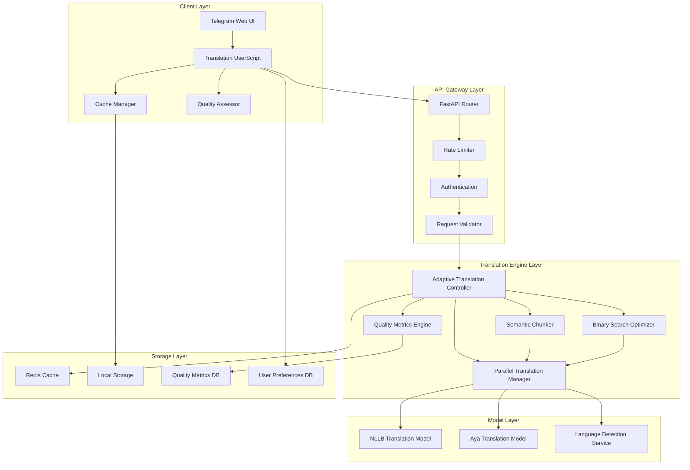
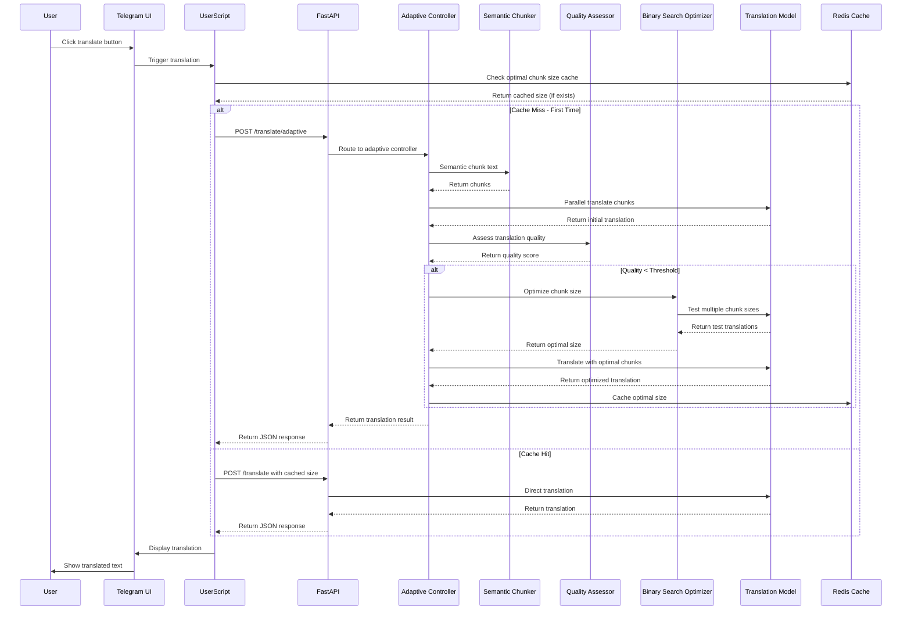

# SPARC Architecture: Adaptive Translation Chunking System

**Project**: Telegram NLLB Translation Enhancement  
**Component**: Adaptive Translation Chunking  
**SPARC Phase**: 3 - Architecture  
**Date**: May 2025

## System Architecture Overview

### High-Level Component Diagram



### Data Flow Architecture



## Component Architecture Details

### 1. Client Layer Components

#### Translation UserScript (Enhanced)
```typescript
interface AdaptiveTranslationConfig {
  server: string;
  apiKey: string;
  qualityThreshold: number;
  speedMode: boolean;
  maxOptimizationTime: number;
  cacheEnabled: boolean;
}

class AdaptiveTranslationClient {
  private config: AdaptiveTranslationConfig;
  private cacheManager: CacheManager;
  private qualityAssessor: ClientQualityAssessor;
  
  async translateText(text: string, sourceLang: string, targetLang: string): Promise<TranslationResult> {
    // Check local cache first
    const cachedSize = await this.cacheManager.getOptimalSize(text, sourceLang, targetLang);
    
    if (cachedSize) {
      return await this.translateWithSize(text, sourceLang, targetLang, cachedSize);
    }
    
    // Fast path with quality assessment
    const fastResult = await this.semanticTranslate(text, sourceLang, targetLang);
    const qualityScore = await this.qualityAssessor.assess(text, fastResult.translation);
    
    if (qualityScore >= this.config.qualityThreshold || this.config.speedMode) {
      return fastResult;
    }
    
    // Optimization path
    return await this.optimizeTranslation(text, sourceLang, targetLang);
  }
}
```

#### Cache Manager
```typescript
interface CacheEntry {
  chunkSize: number;
  quality: number;
  timestamp: number;
  hits: number;
}

class CacheManager {
  private localStorage: Storage;
  private ttl: number = 7 * 24 * 60 * 60 * 1000; // 7 days
  
  async getOptimalSize(text: string, sourceLang: string, targetLang: string): Promise<number | null> {
    const key = this.generateCacheKey(text, sourceLang, targetLang);
    const entry = this.localStorage.getItem(key);
    
    if (entry && !this.isExpired(entry)) {
      entry.hits++;
      this.localStorage.setItem(key, JSON.stringify(entry));
      return entry.chunkSize;
    }
    
    return null;
  }
  
  private generateCacheKey(text: string, sourceLang: string, targetLang: string): string {
    const contentHash = this.hashContent(text.substring(0, 200));
    const contentType = this.classifyContent(text);
    return `${sourceLang}_${targetLang}_${contentType}_${contentHash}`;
  }
}
```

### 2. API Gateway Layer Components

#### FastAPI Router (Enhanced)
```python
from fastapi import FastAPI, HTTPException, Depends, BackgroundTasks
from .models import AdaptiveTranslationRequest, TranslationResult

app = FastAPI()

@app.post("/translate/adaptive", response_model=TranslationResult)
async def adaptive_translate(
    request: AdaptiveTranslationRequest,
    background_tasks: BackgroundTasks,
    api_key: str = Depends(verify_api_key)
):
    """Adaptive translation with quality optimization."""
    controller = AdaptiveTranslationController()
    result = await controller.translate(request)
    
    # Background task to update global cache
    if result.optimized:
        background_tasks.add_task(
            update_global_cache, 
            request.text, 
            request.source_lang, 
            request.target_lang, 
            result.optimal_chunk_size
        )
    
    return result

@app.post("/translate/semantic", response_model=TranslationResult)
async def semantic_translate(
    request: TranslationRequest,
    api_key: str = Depends(verify_api_key)
):
    """Fast semantic chunking translation."""
    chunker = SemanticChunker()
    chunks = chunker.chunk(request.text)
    
    translator = ParallelTranslationManager()
    result = await translator.translate_chunks(chunks, request.source_lang, request.target_lang)
    
    return TranslationResult(
        translated_text=result,
        chunks=len(chunks),
        method="semantic",
        processing_time=time.time() - start_time
    )
```

#### Rate Limiter (Enhanced)
```python
from slowapi import Limiter, _rate_limit_exceeded_handler
from slowapi.util import get_remote_address

class AdaptiveRateLimiter:
    def __init__(self):
        self.limiter = Limiter(key_func=get_remote_address)
        
    def adaptive_limit(self, request_type: str):
        """Different rate limits for different request types."""
        limits = {
            "semantic": "30/minute",      # Fast path - higher limit
            "adaptive": "10/minute",      # Optimization path - lower limit
            "health": "60/minute"         # Health checks - highest limit
        }
        return self.limiter.limit(limits.get(request_type, "20/minute"))
```

### 3. Translation Engine Layer Components

#### Adaptive Translation Controller
```python
class AdaptiveTranslationController:
    def __init__(self):
        self.semantic_chunker = SemanticChunker()
        self.quality_assessor = QualityMetricsEngine()
        self.optimizer = BinarySearchOptimizer()
        self.translator = ParallelTranslationManager()
        self.cache = CacheManager()
        
    async def translate(self, request: AdaptiveTranslationRequest) -> TranslationResult:
        start_time = time.time()
        
        # Check cache for optimal chunk size
        cache_key = self.generate_cache_key(request)
        cached_size = await self.cache.get_optimal_size(cache_key)
        
        if cached_size:
            # Use cached optimal size
            chunks = self.create_chunks(request.text, cached_size)
            translation = await self.translator.translate_chunks(
                chunks, request.source_lang, request.target_lang
            )
            return TranslationResult(
                translated_text=translation,
                method="cached",
                chunks=len(chunks),
                chunk_size=cached_size,
                processing_time=time.time() - start_time
            )
        
        # Fast path: semantic chunking
        semantic_chunks = self.semantic_chunker.chunk(request.text)
        initial_translation = await self.translator.translate_chunks(
            semantic_chunks, request.source_lang, request.target_lang
        )
        
        # Quality assessment
        quality_score = self.quality_assessor.assess(
            request.text, initial_translation, semantic_chunks
        )
        
        # Return fast result if quality is good enough
        if quality_score >= request.quality_threshold or request.speed_mode:
            return TranslationResult(
                translated_text=initial_translation,
                method="semantic",
                quality_score=quality_score,
                chunks=len(semantic_chunks),
                processing_time=time.time() - start_time
            )
        
        # Optimization path
        optimal_size = await self.optimizer.find_optimal_size(
            request.text, request.source_lang, request.target_lang
        )
        
        optimal_chunks = self.create_chunks(request.text, optimal_size)
        optimized_translation = await self.translator.translate_chunks(
            optimal_chunks, request.source_lang, request.target_lang
        )
        
        # Cache the optimal size
        await self.cache.store_optimal_size(cache_key, optimal_size)
        
        return TranslationResult(
            translated_text=optimized_translation,
            method="optimized",
            quality_score=quality_score,
            chunks=len(optimal_chunks),
            optimal_chunk_size=optimal_size,
            optimized=True,
            processing_time=time.time() - start_time
        )
```

#### Semantic Chunker
```python
import re
from typing import List

class SemanticChunker:
    def __init__(self, max_chunk_size: int = 500):
        self.max_chunk_size = max_chunk_size
        self.sentence_patterns = [
            r'\.[\s\n]+', r'![\s\n]+', r'\?[\s\n]+',  # Sentence terminators
            r'\.\"[\s\n]+', r'!\"[\s\n]+', r'\?\"[\s\n]+'  # Quoted sentences
        ]
        self.clause_patterns = [
            r',\s+', r';\s+', r':\s+', r'\s+[-—]\s+'  # Clause separators
        ]
    
    def chunk(self, text: str) -> List[str]:
        """Split text into semantic chunks."""
        if len(text) <= self.max_chunk_size:
            return [text]
        
        # First, try sentence-level splitting
        sentences = self._split_sentences(text)
        chunks = []
        current_chunk = ""
        
        for sentence in sentences:
            if len(current_chunk + sentence) <= self.max_chunk_size:
                current_chunk += sentence
            else:
                if current_chunk:
                    chunks.append(current_chunk.strip())
                
                # Handle very long sentences
                if len(sentence) > self.max_chunk_size:
                    chunks.extend(self._split_long_sentence(sentence))
                    current_chunk = ""
                else:
                    current_chunk = sentence
        
        if current_chunk:
            chunks.append(current_chunk.strip())
        
        return [chunk for chunk in chunks if chunk.strip()]
    
    def _split_sentences(self, text: str) -> List[str]:
        """Split text into sentences using regex patterns."""
        sentences = []
        current_pos = 0
        
        for pattern in self.sentence_patterns:
            matches = list(re.finditer(pattern, text))
            for match in matches:
                sentence = text[current_pos:match.end()].strip()
                if sentence:
                    sentences.append(sentence)
                current_pos = match.end()
        
        # Add remaining text
        if current_pos < len(text):
            remaining = text[current_pos:].strip()
            if remaining:
                sentences.append(remaining)
        
        return sentences
    
    def _split_long_sentence(self, sentence: str) -> List[str]:
        """Split very long sentences on clause boundaries."""
        if len(sentence) <= self.max_chunk_size:
            return [sentence]
        
        # Try clause-level splitting
        for pattern in self.clause_patterns:
            parts = re.split(pattern, sentence)
            if len(parts) > 1:
                chunks = []
                current = ""
                
                for part in parts:
                    if len(current + part) <= self.max_chunk_size:
                        current += part
                    else:
                        if current:
                            chunks.append(current.strip())
                        current = part
                
                if current:
                    chunks.append(current.strip())
                
                return chunks
        
        # Force split on word boundaries if no clause markers
        return self._force_split_on_words(sentence)
    
    def _force_split_on_words(self, text: str) -> List[str]:
        """Force split on word boundaries as last resort."""
        words = text.split()
        chunks = []
        current = ""
        
        for word in words:
            if len(current + " " + word) <= self.max_chunk_size:
                current += " " + word if current else word
            else:
                if current:
                    chunks.append(current.strip())
                current = word
        
        if current:
            chunks.append(current.strip())
        
        return chunks
```

#### Quality Metrics Engine
```python
import re
from typing import Dict, List
from dataclasses import dataclass

@dataclass
class QualityMetrics:
    confidence: float
    length_consistency: float
    structure_integrity: float
    entity_preservation: float
    boundary_coherence: float
    composite_score: float

class QualityMetricsEngine:
    def __init__(self):
        self.weights = {
            'confidence': 0.3,
            'length_consistency': 0.2,
            'structure_integrity': 0.2,
            'entity_preservation': 0.2,
            'boundary_coherence': 0.1
        }
    
    def assess(self, original: str, translation: str, chunks: List[str] = None) -> QualityMetrics:
        """Assess translation quality using multiple metrics."""
        
        confidence = self._get_model_confidence(translation)
        length_consistency = self._assess_length_consistency(original, translation)
        structure_integrity = self._assess_structure_integrity(translation)
        entity_preservation = self._assess_entity_preservation(original, translation)
        boundary_coherence = self._assess_boundary_coherence(chunks, translation) if chunks else 1.0
        
        composite_score = (
            self.weights['confidence'] * confidence +
            self.weights['length_consistency'] * length_consistency +
            self.weights['structure_integrity'] * structure_integrity +
            self.weights['entity_preservation'] * entity_preservation +
            self.weights['boundary_coherence'] * boundary_coherence
        )
        
        return QualityMetrics(
            confidence=confidence,
            length_consistency=length_consistency,
            structure_integrity=structure_integrity,
            entity_preservation=entity_preservation,
            boundary_coherence=boundary_coherence,
            composite_score=composite_score
        )
    
    def _assess_length_consistency(self, original: str, translation: str) -> float:
        """Check for sudden length expansions or contractions."""
        orig_len = len(original)
        trans_len = len(translation)
        
        if orig_len == 0:
            return 0.0
        
        ratio = trans_len / orig_len
        
        # Expect ratios between 0.5 and 2.0 for most language pairs
        if ratio < 0.3 or ratio > 3.0:
            return 0.0
        elif 0.8 <= ratio <= 1.5:
            return 1.0
        else:
            return max(0.0, 1.0 - abs(ratio - 1.0) / 2.0)
    
    def _assess_structure_integrity(self, translation: str) -> float:
        """Check for structural issues in translation."""
        score = 1.0
        
        # Check for incomplete sentences
        sentences = re.split(r'[.!?]+', translation)
        for sentence in sentences:
            if self._is_incomplete_sentence(sentence.strip()):
                score -= 0.1
        
        # Check for repeated phrases (translation artifacts)
        repeated_phrases = self._find_repeated_phrases(translation)
        score -= len(repeated_phrases) * 0.05
        
        # Check for obvious translation artifacts
        artifacts = ['[UNK]', '<unk>', '...', '???']
        for artifact in artifacts:
            if artifact in translation:
                score -= 0.1
        
        return max(0.0, score)
    
    def _assess_entity_preservation(self, original: str, translation: str) -> float:
        """Check if named entities are preserved."""
        orig_entities = self._extract_entities(original)
        trans_entities = self._extract_entities(translation)
        
        if not orig_entities:
            return 1.0
        
        preserved = 0
        for entity in orig_entities:
            if any(self._entities_similar(entity, trans_entity) for trans_entity in trans_entities):
                preserved += 1
        
        return preserved / len(orig_entities)
    
    def _extract_entities(self, text: str) -> List[str]:
        """Extract named entities (simple pattern-based approach)."""
        # Numbers, dates, proper nouns (capitalized words)
        patterns = [
            r'\b\d+\b',  # Numbers
            r'\b[A-ZА-Я][a-zа-я]+\b',  # Capitalized words
            r'\b\d{1,2}[/.]\d{1,2}[/.]\d{2,4}\b'  # Dates
        ]
        
        entities = []
        for pattern in patterns:
            entities.extend(re.findall(pattern, text))
        
        return entities
```

#### Binary Search Optimizer
```python
import asyncio
from typing import Tuple

class BinarySearchOptimizer:
    def __init__(self):
        self.min_chunk_size = 50
        self.max_chunk_size = 2000
        self.max_iterations = 8
        self.quality_threshold = 0.85
        self.translator = ParallelTranslationManager()
        self.quality_assessor = QualityMetricsEngine()
    
    async def find_optimal_size(self, text: str, source_lang: str, target_lang: str) -> int:
        """Find optimal chunk size using binary search."""
        min_size = self.min_chunk_size
        max_size = min(self.max_chunk_size, len(text))
        best_size = min_size
        best_quality = 0.0
        
        for iteration in range(self.max_iterations):
            mid_size = (min_size + max_size) // 2
            
            # Test translation quality with this chunk size
            chunks = self._create_chunks(text, mid_size)
            translation = await self.translator.translate_chunks(chunks, source_lang, target_lang)
            quality_metrics = self.quality_assessor.assess(text, translation, chunks)
            quality = quality_metrics.composite_score
            
            # Track best result
            if quality > best_quality:
                best_size = mid_size
                best_quality = quality
            
            # Early termination if quality is excellent
            if quality >= self.quality_threshold:
                return mid_size
            
            # Adjust search range based on quality
            if quality >= 0.7:  # Good quality - try larger chunks
                min_size = mid_size + 1
            else:  # Poor quality - try smaller chunks
                max_size = mid_size - 1
            
            # Prevent infinite loop
            if min_size >= max_size:
                break
        
        return best_size
    
    def _create_chunks(self, text: str, chunk_size: int) -> List[str]:
        """Create chunks of specified size."""
        words = text.split()
        chunks = []
        current_chunk = ""
        
        for word in words:
            test_chunk = current_chunk + " " + word if current_chunk else word
            
            if len(test_chunk) > chunk_size and current_chunk:
                chunks.append(current_chunk.strip())
                current_chunk = word
            else:
                current_chunk = test_chunk
        
        if current_chunk:
            chunks.append(current_chunk.strip())
        
        return chunks
```

#### Parallel Translation Manager
```python
import asyncio
import aiohttp
from typing import List, Dict

class ParallelTranslationManager:
    def __init__(self, max_concurrency: int = 5):
        self.max_concurrency = max_concurrency
        self.semaphore = asyncio.Semaphore(max_concurrency)
    
    async def translate_chunks(self, chunks: List[str], source_lang: str, target_lang: str) -> str:
        """Translate chunks in parallel with concurrency control."""
        tasks = []
        
        for i, chunk in enumerate(chunks):
            task = self._translate_chunk_with_semaphore(
                chunk, source_lang, target_lang, i
            )
            tasks.append(task)
        
        # Execute all tasks in parallel
        results = await asyncio.gather(*tasks, return_exceptions=True)
        
        # Combine results in order
        combined_translation = ""
        for i, result in enumerate(results):
            if isinstance(result, Exception):
                # Handle translation failure
                combined_translation += f"[Translation Error: {str(result)}] "
            else:
                combined_translation += result + " "
        
        return combined_translation.strip()
    
    async def _translate_chunk_with_semaphore(self, chunk: str, source_lang: str, target_lang: str, index: int) -> str:
        """Translate single chunk with semaphore control."""
        async with self.semaphore:
            return await self._translate_single_chunk(chunk, source_lang, target_lang)
    
    async def _translate_single_chunk(self, chunk: str, source_lang: str, target_lang: str) -> str:
        """Translate a single chunk using the translation model."""
        # This would call the actual translation model (NLLB/Aya)
        model = get_translation_model()  # Get appropriate model
        result = await model.translate(chunk, source_lang, target_lang)
        return result.translated_text
```

### 4. Storage Layer Components

#### Redis Cache Manager
```python
import redis
import json
import hashlib
from typing import Optional

class RedisCacheManager:
    def __init__(self, redis_url: str = "redis://localhost:6379"):
        self.redis_client = redis.from_url(redis_url)
        self.ttl = 7 * 24 * 60 * 60  # 7 days
    
    async def get_optimal_size(self, cache_key: str) -> Optional[int]:
        """Get optimal chunk size from cache."""
        try:
            cached_data = self.redis_client.get(cache_key)
            if cached_data:
                entry = json.loads(cached_data)
                return entry['chunk_size']
        except Exception as e:
            logger.warning(f"Cache get error: {e}")
        
        return None
    
    async def store_optimal_size(self, cache_key: str, chunk_size: int, quality: float = 0.0):
        """Store optimal chunk size in cache."""
        try:
            entry = {
                'chunk_size': chunk_size,
                'quality': quality,
                'timestamp': time.time(),
                'hits': 1
            }
            self.redis_client.setex(cache_key, self.ttl, json.dumps(entry))
        except Exception as e:
            logger.warning(f"Cache store error: {e}")
    
    def generate_cache_key(self, text: str, source_lang: str, target_lang: str) -> str:
        """Generate cache key for text pattern."""
        content_hash = hashlib.md5(text[:200].encode()).hexdigest()[:8]
        content_type = self._classify_content(text)
        return f"chunk_size:{source_lang}:{target_lang}:{content_type}:{content_hash}"
```

## Deployment Architecture

### Docker Compose Setup
```yaml
version: '3.8'
services:
  translation-api:
    build: ./server
    ports:
      - "8001:8000"
    environment:
      - REDIS_URL=redis://redis:6379
      - MODEL_TYPE=adaptive
    depends_on:
      - redis
    deploy:
      resources:
        reservations:
          devices:
            - driver: nvidia
              count: 1
              capabilities: [gpu]
  
  redis:
    image: redis:7-alpine
    ports:
      - "6379:6379"
    volumes:
      - redis_data:/data
  
  nginx:
    image: nginx:alpine
    ports:
      - "80:80"
    volumes:
      - ./nginx.conf:/etc/nginx/nginx.conf
    depends_on:
      - translation-api

volumes:
  redis_data:
```

### Monitoring and Observability
```python
from prometheus_client import Counter, Histogram, Gauge
import structlog

# Metrics
translation_requests = Counter('translation_requests_total', 'Total translation requests', ['method', 'language_pair'])
translation_duration = Histogram('translation_duration_seconds', 'Translation duration', ['method'])
optimization_success = Counter('optimization_success_total', 'Successful optimizations')
cache_hits = Counter('cache_hits_total', 'Cache hits', ['cache_type'])
quality_scores = Histogram('quality_scores', 'Translation quality scores')

logger = structlog.get_logger()

class MetricsMiddleware:
    async def __call__(self, request, call_next):
        start_time = time.time()
        response = await call_next(request)
        duration = time.time() - start_time
        
        # Record metrics
        translation_duration.observe(duration)
        
        return response
```

This architecture provides a robust, scalable foundation for the adaptive translation chunking system, implementing the pseudocode algorithms in a production-ready structure with proper separation of concerns, caching, monitoring, and error handling.