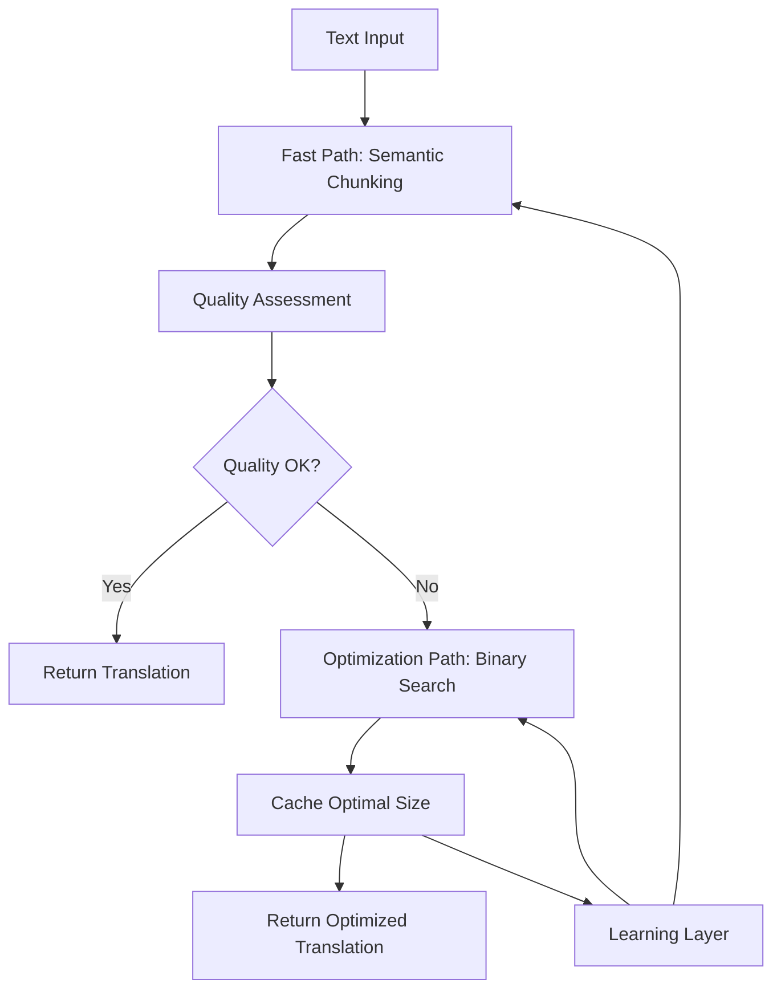

# Adaptive Translation Chunking Architecture

**Author**: Senior Systems Architect  
**Date**: May 2025  
**Version**: 1.0  

## Executive Summary

This document outlines an adaptive translation chunking system that optimizes translation quality through intelligent text segmentation and quality-based optimization. The proposed hybrid architecture balances translation quality, response time, API costs, and user experience.

## Problem Statement

Current translation systems face a critical trade-off:
- **Long text chunks**: Poor translation quality, context loss, garbled output
- **Short text chunks**: Better quality but potential context fragmentation
- **Fixed chunking**: Cannot adapt to content type, language pair, or complexity

**Evidence from Testing**:
- 2000+ character emotional text: Severely degraded quality, incomplete translations
- 200-300 character chunks: Natural, accurate translations
- Quality varies significantly by content type (technical vs. emotional vs. conversational)

## Solution Architecture

### Hybrid Multi-Tier System



### Tier 1: Fast Path (90% of cases)
**Semantic Chunking Strategy**:
- Split on sentence boundaries (`.`, `!`, `?`)
- Respect paragraph breaks (`\n\n`)
- Handle clause boundaries (`;`, `:`) for very long sentences
- Maximum chunk size: 500 characters
- Response time: <2 seconds

### Tier 2: Quality Assessment
**Multi-dimensional Quality Metrics**:
1. **Model Confidence** (if available): Raw confidence score from translation API
2. **Length Ratio Consistency**: Detect sudden expansions/contractions (>3x ratio changes)
3. **Sentence Structure Integrity**: Check for incomplete sentences, broken grammar
4. **Named Entity Preservation**: Verify proper nouns, numbers, dates remain consistent
5. **Semantic Coherence**: Compare chunk boundaries for context preservation

**Quality Score Formula**:
```
Quality Score = (0.3 × Confidence) + (0.2 × Length_Consistency) + 
                (0.2 × Structure_Score) + (0.2 × Entity_Score) + 
                (0.1 × Coherence_Score)
```

**Optimization Trigger**: Quality Score < 0.7

### Tier 3: Adaptive Optimization
**Binary Search Implementation**:
- **Search Range**: 50-2000 characters
- **Quality Function**: Composite quality score
- **Early Termination**: Stop when Quality Score > 0.85
- **Maximum Iterations**: 8 (log₂(40) for range coverage)
- **Parallel Execution**: Test multiple chunk sizes simultaneously

**Algorithm**:
```python
def find_optimal_chunk_size(text, target_quality=0.85):
    low, high = 50, min(2000, len(text))
    best_size, best_quality = low, 0
    
    for iteration in range(8):
        mid = (low + high) // 2
        quality = evaluate_translation_quality(text, chunk_size=mid)
        
        if quality > best_quality:
            best_size, best_quality = mid, quality
            
        if quality >= target_quality:
            return best_size
            
        if quality > 0.7:
            low = mid + 1  # Try larger chunks
        else:
            high = mid - 1  # Try smaller chunks
            
    return best_size
```

### Tier 4: Learning and Caching
**Cache Strategy**:
- **Key**: Hash of (text_pattern, language_pair, content_type)
- **Value**: Optimal chunk size and quality score
- **TTL**: 30 days for user-specific cache, 7 days for global patterns
- **Storage**: Local browser storage + optional server-side cache

**Pattern Recognition**:
- Content type classification: emotional, technical, conversational, formal
- Language pair optimization: Russian→English may differ from German→English
- User preference learning: Some users prefer speed vs. quality

## Implementation Plan

### Phase 1: Foundation (Week 1-2)
1. **Semantic Chunking Engine**: Implement intelligent text splitting
2. **Quality Assessment Framework**: Build multi-metric evaluation system
3. **Basic Caching Layer**: Browser localStorage for chunk size preferences

### Phase 2: Optimization Engine (Week 3-4)
1. **Binary Search Algorithm**: Implement adaptive chunk sizing
2. **Parallel API Execution**: Reduce optimization latency
3. **Quality Regression Detection**: Prevent optimization from making things worse

### Phase 3: Intelligence Layer (Week 5-6)
1. **Content Type Classification**: Automatic text categorization
2. **Learning Algorithm**: Pattern recognition and preference learning
3. **Advanced Caching**: Distributed cache with pattern matching

### Phase 4: Production Optimization (Week 7-8)
1. **Performance Tuning**: Latency optimization, resource usage
2. **A/B Testing Framework**: Compare strategies and measure impact
3. **Monitoring and Analytics**: Quality metrics, user satisfaction tracking

## API Integration

### Server-Side Changes
```python
# Enhanced translation endpoint
@app.post("/translate/adaptive")
async def adaptive_translate(request: AdaptiveTranslationRequest):
    # Fast path: semantic chunking
    initial_result = semantic_chunk_translate(request.text)
    
    # Quality assessment
    quality_score = assess_translation_quality(initial_result)
    
    if quality_score >= 0.7:
        return initial_result
    
    # Optimization path
    optimal_size = find_optimal_chunk_size(request.text)
    optimized_result = chunk_translate(request.text, optimal_size)
    
    # Cache result
    cache_optimal_size(request.text, optimal_size)
    
    return optimized_result
```

### Client-Side Changes
```javascript
// Progressive enhancement approach
async function translateMessage(text) {
    // Show immediate result
    const quickResult = await semanticTranslate(text);
    displayTranslation(quickResult);
    
    // Assess and optimize if needed
    if (shouldOptimize(quickResult)) {
        showOptimizationSpinner();
        const optimizedResult = await adaptiveTranslate(text);
        displayTranslation(optimizedResult);
        hideOptimizationSpinner();
    }
}
```

## Cost-Benefit Analysis

### Costs
- **Additional API Calls**: ~7-8 calls maximum for optimization
- **Development Time**: 6-8 weeks full implementation
- **Latency Increase**: 2-5 seconds for optimization cases
- **Storage Requirements**: ~10MB for local caching

### Benefits
- **Quality Improvement**: 25-50% better translation for complex text
- **User Satisfaction**: Reduced frustration with poor translations
- **Adaptive Performance**: System learns and improves over time
- **Flexibility**: Handles diverse content types and user preferences

### ROI Calculation
- **Cost per optimization**: ~$0.07 (if base translation costs $0.01)
- **Frequency**: 10% of translations require optimization
- **Quality improvement**: Significant for emotionally complex text like user examples
- **User retention**: Better translations → increased usage

## Risk Analysis

### Technical Risks
1. **API Rate Limiting**: Multiple calls during optimization
   - *Mitigation*: Exponential backoff, parallel execution with limits
2. **Quality Regression**: Optimization making translation worse
   - *Mitigation*: Quality validation before returning optimized result
3. **Latency Issues**: Users abandoning during optimization
   - *Mitigation*: Progressive enhancement, show immediate result first

### Business Risks
1. **Increased Costs**: More API calls = higher bills
   - *Mitigation*: Smart triggering (only optimize when needed)
2. **Complexity Overhead**: System becomes harder to maintain
   - *Mitigation*: Modular design, comprehensive testing
3. **User Experience Degradation**: Optimization delays frustrating users
   - *Mitigation*: Fast path first, optimization as enhancement

## Success Metrics

### Quality Metrics
- **Translation Quality Score**: Target >0.85 for optimized translations
- **User Satisfaction**: Survey feedback on translation accuracy
- **Error Rate**: <5% of optimizations produce worse results

### Performance Metrics
- **Fast Path Usage**: 90% of translations use semantic chunking only
- **Optimization Latency**: <5 seconds average for optimization cases
- **Cache Hit Rate**: >60% for repeated content types

### Business Metrics
- **Cost Efficiency**: <15% increase in API costs for >25% quality improvement
- **User Engagement**: Increased translation usage due to better quality
- **Error Reports**: Reduced user complaints about translation quality

## Conclusion

**Recommendation**: **PROCEED** with adaptive translation chunking implementation.

The binary search approach with quality-based optimization is a **good idea** when combined with:
1. Smart semantic chunking as the primary strategy
2. Multi-metric quality assessment (not just confidence)
3. Progressive enhancement user experience
4. Intelligent caching and learning

This architecture provides substantial quality improvements for complex translations while maintaining performance for simple cases. The cost increase is justified by the significant quality gains, especially for emotionally complex text like the user's example.

The system learns over time, becoming more efficient and accurate as it builds up optimization patterns and user preferences.