# Client Integration Architecture Diagrams

## Browser UserScript Integration

```mermaid
graph TB
    subgraph "Telegram Web Environment"
        TELEGRAM[🌐 web.telegram.org/k<br/>Dynamic DOM]
        MESSAGES[💬 Message Bubbles<br/>Text Content]
        UI[🎨 Telegram UI<br/>Chat Interface]
    end
    
    subgraph "UserScript Layer"
        TAMPER[🔧 Tampermonkey<br/>Script Runtime]
        OBSERVER[👁️ MutationObserver<br/>DOM Monitoring]
        INJECTION[💉 UI Injection<br/>Translation Controls]
    end
    
    subgraph "Translation Features"
        BUTTON[🌐 Translate Button<br/>Per Message]
        PROGRESS[⏳ Progress Indicator<br/>Real-time Feedback]
        CACHE[💾 Local Cache<br/>Translation Storage]
        TOOLTIP[💭 Hover Tooltip<br/>Original Text]
    end
    
    subgraph "API Communication"
        DETECT[🔍 Auto-detection<br/>Language Recognition]
        SIMPLE[📡 Simple Translation<br/>Legacy API]
        ADAPTIVE[⚡ Adaptive Translation<br/>Long Text Processing]
        STREAM[📊 Progressive Results<br/>Server-Sent Events]
    end
    
    TELEGRAM --> TAMPER
    TAMPER --> OBSERVER
    OBSERVER --> MESSAGES
    MESSAGES --> INJECTION
    
    INJECTION --> BUTTON
    INJECTION --> PROGRESS
    INJECTION --> CACHE
    INJECTION --> TOOLTIP
    
    BUTTON --> DETECT
    DETECT --> SIMPLE
    DETECT --> ADAPTIVE
    ADAPTIVE --> STREAM
    
    STREAM --> PROGRESS
    SIMPLE --> CACHE
    ADAPTIVE --> CACHE
```

## AutoHotkey Desktop Integration

## Multi-Platform Client Comparison

```mermaid
graph TB
    subgraph "UserScript Features"
        U1[✓ Telegram Web Integration]
        U2[✓ Per-message Translation]
        U3[✓ Progressive Translation]
        U4[✓ Visual Feedback]
        U5[✓ Local Caching]
        U6[✓ Hover Tooltips]
    end
    
    subgraph "AutoHotkey Features"
        A1[✓ System-wide Translation]
        A2[✓ Multiple Hotkeys]
        A3[✓ Text Replacement]
        A4[✓ Clipboard Integration]
        A5[✓ Model Selection]
        A6[✓ Tray Integration]
    end
    
    subgraph "Shared Capabilities"
        S1[🔄 Multi-Model Support]
        S2[🌐 API Communication]
        S3[🔍 Language Detection]
        S4[⚡ Adaptive Processing]
        S5[💾 Result Caching]
        S6[❌ Error Handling]
    end
    
    U1 --> S1
    U2 --> S2
    U3 --> S4
    U4 --> S6
    U5 --> S5
    U6 --> S3
    
    A1 --> S1
    A2 --> S2
    A3 --> S4
    A4 --> S6
    A5 --> S5
    A6 --> S3
```

## UserScript State Management

## AutoHotkey Workflow

## Client Configuration Management

```mermaid
graph LR
    subgraph "UserScript Config"
        UC[📝 Script Variables<br/>- Server URL<br/>- API endpoints<br/>- UI preferences]
        UG[🔧 GM_setValue/getValue<br/>Persistent storage]
        UU[👤 User Settings<br/>Tampermonkey UI]
    end
    
    subgraph "AutoHotkey Config"
        AC[📝 CONFIG Object<br/>- Server settings<br/>- Hotkey bindings<br/>- Behavior options]
        AF[📄 INI Files<br/>settings.ini]
        AT[🖱️ Tray Menu<br/>Runtime settings]
    end
    
    subgraph "Shared Settings"
        SERVER[🌐 Server URL<br/>Translation endpoint]
        AUTH[🔐 API Keys<br/>Authentication]
        LANG[🗣️ Language Preferences<br/>Default target language]
        CACHE[💾 Cache Settings<br/>TTL and storage]
    end
    
    UC --> UG
    UG --> UU
    UU --> SERVER
    UU --> AUTH
    UU --> LANG
    UU --> CACHE
    
    AC --> AF
    AF --> AT
    AT --> SERVER
    AT --> AUTH
    AT --> LANG
    AT --> CACHE
```

## Error Handling and Recovery

```mermaid
graph TB
    subgraph "Error Types"
        NETWORK[🌐 Network Errors<br/>Connection timeout<br/>Server unreachable]
        API[📡 API Errors<br/>Invalid response<br/>Rate limiting]
        AUTH[🔐 Authentication<br/>Invalid API key<br/>Permission denied]
        PARSE[📝 Parsing Errors<br/>Invalid JSON<br/>Malformed response]
    end
    
    subgraph "Recovery Strategies"
        RETRY[🔄 Retry Logic<br/>Exponential backoff<br/>Max attempts]
        FALLBACK[⬇️ Graceful Degradation<br/>Simplified features<br/>Cache-only mode]
        USER[👤 User Notification<br/>Error messages<br/>Suggested actions]
        LOG[📊 Error Logging<br/>Debug information<br/>Performance metrics]
    end
    
    subgraph "Client-Specific Handling"
        US_ERROR[UserScript<br/>- DOM error display<br/>- Tooltip notifications<br/>- Console logging]
        AHK_ERROR[AutoHotkey<br/>- System notifications<br/>- Tray messages<br/>- Error dialogs]
    end
    
    NETWORK --> RETRY
    API --> FALLBACK
    AUTH --> USER
    PARSE --> LOG
    
    RETRY --> US_ERROR
    FALLBACK --> US_ERROR
    USER --> US_ERROR
    LOG --> US_ERROR
    
    RETRY --> AHK_ERROR
    FALLBACK --> AHK_ERROR
    USER --> AHK_ERROR
    LOG --> AHK_ERROR
```

## Performance Optimization

```mermaid
graph TB
    subgraph "UserScript Optimizations"
        DOM[🎯 DOM Efficiency<br/>- Minimal queries<br/>- Event delegation<br/>- Virtual scrolling]
        CACHE_US[💾 Client Caching<br/>- Translation cache<br/>- DOM element cache<br/>- Settings cache]
        BATCH[📦 Request Batching<br/>- Multiple messages<br/>- Debounced requests<br/>- Connection pooling]
    end
    
    subgraph "AutoHotkey Optimizations"
        MEM[🧠 Memory Management<br/>- Object cleanup<br/>- Variable scoping<br/>- Timer management]
        CACHE_AHK[💾 Response Caching<br/>- Translation cache<br/>- Language detection<br/>- Server responses]
        ASYNC[⚡ Async Operations<br/>- Non-blocking requests<br/>- Background processing<br/>- Queue management]
    end
    
    subgraph "Shared Optimizations"
        COMPRESS[🗜️ Data Compression<br/>- Request compression<br/>- Response compression<br/>- Cache compression]
        SMART[🧠 Smart Requests<br/>- Cache-first strategy<br/>- Conditional requests<br/>- Request deduplication]
        MONITOR[📊 Performance Monitoring<br/>- Response time tracking<br/>- Error rate monitoring<br/>- Cache hit rates]
    end
    
    DOM --> SMART
    CACHE_US --> SMART
    BATCH --> COMPRESS
    
    MEM --> MONITOR
    CACHE_AHK --> SMART
    ASYNC --> COMPRESS
    
    COMPRESS --> MONITOR
    SMART --> MONITOR
```

