# Data Flow and Processing Diagrams

## Complete Translation Request Lifecycle

## Adaptive Text Processing Pipeline

```mermaid
graph TB
    subgraph "Input Analysis"
        INPUT[📝 Input Text<br/>Any length, complexity]
        PREPROCESS[🔍 Preprocessing<br/>- Text normalization<br/>- Language detection<br/>- Complexity scoring]
        DECISION{Processing Strategy}
    end
    
    subgraph "Simple Path"
        DIRECT[⚡ Direct Translation<br/>Single model call]
        SIMPLE_CACHE[💾 Simple Cache<br/>Store result]
    end
    
    subgraph "Complex Path"
        SEGMENT[🧩 Text Segmentation<br/>- Sentence boundaries<br/>- Semantic units<br/>- Context preservation]
        OPTIMIZE[🎯 Chunk Optimization<br/>- Binary search<br/>- Size optimization<br/>- Quality prediction]
        PARALLEL[⚡ Parallel Processing<br/>Multiple model instances]
    end
    
    subgraph "Quality Control"
        ASSESS[📊 Quality Assessment<br/>- Fluency scoring<br/>- Accuracy metrics<br/>- Consistency check]
        VALIDATE{Quality Threshold}
        IMPROVE[🔄 Improvement Loop<br/>- Rechunking<br/>- Model switching<br/>- Parameter tuning]
    end
    
    subgraph "Output Assembly"
        ASSEMBLE[🔧 Result Assembly<br/>- Chunk combination<br/>- Flow optimization<br/>- Final polishing]
        FINAL_CACHE[💾 Result Caching<br/>- Store complete result<br/>- Quality metadata<br/>- Performance metrics]
        OUTPUT[📤 Final Output<br/>Optimized translation]
    end
    
    INPUT --> PREPROCESS
    PREPROCESS --> DECISION
    
    DECISION -->|Simple| DIRECT
    DECISION -->|Complex| SEGMENT
    
    DIRECT --> SIMPLE_CACHE
    SIMPLE_CACHE --> OUTPUT
    
    SEGMENT --> OPTIMIZE
    OPTIMIZE --> PARALLEL
    PARALLEL --> ASSESS
    
    ASSESS --> VALIDATE
    VALIDATE -->|Pass| ASSEMBLE
    VALIDATE -->|Fail| IMPROVE
    
    IMPROVE --> SEGMENT
    
    ASSEMBLE --> FINAL_CACHE
    FINAL_CACHE --> OUTPUT
```

## Model Selection and Routing Logic

```mermaid
graph TB
    subgraph "Request Analysis"
        REQ[📥 Translation Request]
        ANALYZE[🔍 Request Analysis<br/>- Text length<br/>- Language pair<br/>- Complexity score<br/>- User preference]
        CONTEXT[📚 Context Assessment<br/>- Domain detection<br/>- Style analysis<br/>- Technical content]
    end
    
    subgraph "Model Capabilities"
        NLLB_CAP[📚 NLLB Capabilities<br/>- Fast processing<br/>- High accuracy<br/>- 200+ languages<br/>- Lightweight]
        AYA_CAP[🤖 Aya Capabilities<br/>- Context awareness<br/>- Conversational style<br/>- Technical knowledge<br/>- Large vocabulary]
    end
    
    subgraph "Selection Criteria"
        SPEED{Speed Priority?}
        CONTEXT_NEED{Context Required?}
        TECHNICAL{Technical Content?}
        LENGTH{Text Length}
    end
    
    subgraph "Routing Decision"
        ROUTE_NLLB[→ NLLB Model<br/>Fast, efficient]
        ROUTE_AYA[→ Aya Model<br/>Context-aware]
        ROUTE_HYBRID[→ Hybrid Approach<br/>Both models]
        ROUTE_ADAPTIVE[→ Adaptive Processing<br/>Dynamic selection]
    end
    
    REQ --> ANALYZE
    ANALYZE --> CONTEXT
    
    CONTEXT --> SPEED
    CONTEXT --> CONTEXT_NEED
    CONTEXT --> TECHNICAL
    CONTEXT --> LENGTH
    
    SPEED -->|Yes| ROUTE_NLLB
    CONTEXT_NEED -->|Yes| ROUTE_AYA
    TECHNICAL -->|Yes| ROUTE_AYA
    LENGTH -->|Long| ROUTE_ADAPTIVE
    LENGTH -->|Medium| ROUTE_HYBRID
    LENGTH -->|Short| ROUTE_NLLB
    
    NLLB_CAP -.-> ROUTE_NLLB
    AYA_CAP -.-> ROUTE_AYA
    NLLB_CAP -.-> ROUTE_HYBRID
    AYA_CAP -.-> ROUTE_HYBRID
    NLLB_CAP -.-> ROUTE_ADAPTIVE
    AYA_CAP -.-> ROUTE_ADAPTIVE
```

## Caching Strategy and Data Flow

```mermaid
graph TB
    subgraph "Cache Layers"
        L1[⚡ L1 Cache<br/>In-Memory<br/>Hot translations<br/>1 minute TTL]
        L2[💾 L2 Cache<br/>Redis<br/>Common translations<br/>1 hour TTL]
        L3[📀 L3 Cache<br/>Persistent<br/>Historical data<br/>24 hour TTL]
    end
    
    subgraph "Cache Keys"
        TEXT_KEY[🔑 Text Hash<br/>SHA-256 of normalized text]
        LANG_KEY[🗣️ Language Pair<br/>source_lang:target_lang]
        MODEL_KEY[🤖 Model Version<br/>model_name:version]
        QUAL_KEY[📊 Quality Level<br/>quality_threshold]
        COMPOSITE[🔧 Composite Key<br/>text:lang:model:quality]
    end
    
    subgraph "Cache Operations"
        READ[📖 Cache Read<br/>- Key lookup<br/>- TTL validation<br/>- Hit/miss logging]
        WRITE[✍️ Cache Write<br/>- Result storage<br/>- Metadata tagging<br/>- Expiry setting]
        INVALIDATE[🗑️ Cache Invalidation<br/>- Model updates<br/>- Quality changes<br/>- Manual refresh]
    end
    
    subgraph "Cache Intelligence"
        PREDICT[🔮 Predictive Caching<br/>- Usage patterns<br/>- Popular texts<br/>- Preemptive loading]
        OPTIMIZE[⚡ Cache Optimization<br/>- LRU eviction<br/>- Size management<br/>- Performance tuning]
        DISTRIBUTE[🌐 Distribution<br/>- Multi-instance sync<br/>- Consistency control<br/>- Replication]
    end
    
    TEXT_KEY --> COMPOSITE
    LANG_KEY --> COMPOSITE
    MODEL_KEY --> COMPOSITE
    QUAL_KEY --> COMPOSITE
    
    COMPOSITE --> READ
    READ --> L1
    L1 -->|Miss| L2
    L2 -->|Miss| L3
    L3 -->|Miss| WRITE
    
    WRITE --> L3
    WRITE --> L2
    WRITE --> L1
    
    PREDICT --> L1
    OPTIMIZE --> L2
    DISTRIBUTE --> L3
    
    INVALIDATE --> L1
    INVALIDATE --> L2
    INVALIDATE --> L3
```

## Progressive Translation Streaming

## Error Propagation and Recovery

```mermaid
graph TB
    subgraph "Error Sources"
        MODEL_ERR[🤖 Model Errors<br/>- Out of memory<br/>- Model loading failure<br/>- Inference timeout]
        API_ERR[📡 API Errors<br/>- Invalid request<br/>- Rate limiting<br/>- Authentication failure]
        NETWORK_ERR[🌐 Network Errors<br/>- Connection timeout<br/>- DNS resolution<br/>- SSL handshake]
        SYSTEM_ERR[💻 System Errors<br/>- Disk space<br/>- CPU overload<br/>- Memory exhaustion]
    end
    
    subgraph "Error Detection"
        MONITOR[📊 Error Monitoring<br/>- Health checks<br/>- Performance metrics<br/>- Alert thresholds]
        LOG[📝 Error Logging<br/>- Structured logging<br/>- Error categorization<br/>- Context capture]
        TRACE[🔍 Distributed Tracing<br/>- Request tracking<br/>- Service correlation<br/>- Timeline analysis]
    end
    
    subgraph "Recovery Strategies"
        RETRY[🔄 Retry Logic<br/>- Exponential backoff<br/>- Circuit breaker<br/>- Jitter addition]
        FALLBACK[⬇️ Graceful Fallback<br/>- Model switching<br/>- Cache serving<br/>- Simplified processing]
        ISOLATION[🏗️ Fault Isolation<br/>- Service boundaries<br/>- Resource limits<br/>- Bulkhead pattern]
        HEAL[🩹 Self-Healing<br/>- Auto-restart<br/>- Resource cleanup<br/>- State recovery]
    end
    
    subgraph "Client Impact"
        GRACEFUL[✅ Graceful Degradation<br/>- Partial results<br/>- Quality indication<br/>- Alternative options]
        NOTIFY[📢 User Notification<br/>- Error messages<br/>- Suggested actions<br/>- Status updates]
        COMPENSATE[🔄 Compensation<br/>- Request queuing<br/>- Background retry<br/>- Credit system]
    end
    
    MODEL_ERR --> MONITOR
    API_ERR --> LOG
    NETWORK_ERR --> TRACE
    SYSTEM_ERR --> MONITOR
    
    MONITOR --> RETRY
    LOG --> FALLBACK
    TRACE --> ISOLATION
    
    RETRY --> GRACEFUL
    FALLBACK --> NOTIFY
    ISOLATION --> COMPENSATE
    HEAL --> GRACEFUL
```

## Quality Assessment Pipeline

```mermaid
graph TB
    subgraph "Input Processing"
        ORIG[📝 Original Text<br/>Source content]
        TRANS[🔄 Translation Result<br/>Model output]
        META[📊 Metadata<br/>- Model used<br/>- Processing time<br/>- Chunk info]
    end
    
    subgraph "Quality Metrics"
        FLUENCY[📖 Fluency Assessment<br/>- Grammar checking<br/>- Readability score<br/>- Style consistency<br/>Weight: 30%]
        ACCURACY[🎯 Accuracy Measurement<br/>- Semantic similarity<br/>- Embedding distance<br/>- BLEU-like scoring<br/>Weight: 40%]
        CONSISTENCY[🔄 Consistency Check<br/>- Term alignment<br/>- Style uniformity<br/>- Context preservation<br/>Weight: 20%]
        CONTEXT[📚 Context Preservation<br/>- Meaning retention<br/>- Cultural adaptation<br/>- Domain accuracy<br/>Weight: 10%]
    end
    
    subgraph "Scoring Engine"
        CALCULATE[🧮 Score Calculation<br/>Weighted average]
        NORMALIZE[📏 Score Normalization<br/>0.0 to 1.0 scale]
        THRESHOLD{Quality Gate<br/>Score ≥ 0.8?}
    end
    
    subgraph "Quality Actions"
        ACCEPT[✅ Accept Translation<br/>High quality result]
        IMPROVE[🔧 Improvement Required<br/>- Rechunking<br/>- Model switching<br/>- Parameter tuning]
        REJECT[❌ Reject & Retry<br/>Quality too low]
        CACHE_DECISION[💾 Cache Decision<br/>Based on quality score]
    end
    
    ORIG --> FLUENCY
    TRANS --> FLUENCY
    META --> FLUENCY
    
    ORIG --> ACCURACY
    TRANS --> ACCURACY
    
    ORIG --> CONSISTENCY
    TRANS --> CONSISTENCY
    
    ORIG --> CONTEXT
    TRANS --> CONTEXT
    
    FLUENCY --> CALCULATE
    ACCURACY --> CALCULATE
    CONSISTENCY --> CALCULATE
    CONTEXT --> CALCULATE
    
    CALCULATE --> NORMALIZE
    NORMALIZE --> THRESHOLD
    
    THRESHOLD -->|Pass| ACCEPT
    THRESHOLD -->|Marginal| IMPROVE
    THRESHOLD -->|Fail| REJECT
    
    ACCEPT --> CACHE_DECISION
    IMPROVE --> CACHE_DECISION
```

