# Multi-Model Translation System Architecture Diagrams

## High-Level System Overview

```mermaid
graph TB
    subgraph "Client Applications"
        UA[🌐 Telegram Web UserScript<br/>Progressive Translation UI]
        AHK[🖱️ Windows AutoHotkey<br/>System-wide Translation]
        MOB[📱 Mobile App<br/>Future Platform]
    end
    
    subgraph "Load Balancer & Security"
        LB[⚖️ nginx Load Balancer<br/>Model-Aware Routing]
        WAF[🛡️ Web Application Firewall<br/>API Protection]
    end
    
    subgraph "Multi-Tier API Services"
        LEGACY[📡 Legacy NLLB API<br/>Port 8001 - Backward Compatible]
        MULTI[🔄 Multi-Model API<br/>Port 8003 - Model Selection]
        ADAPTIVE[⚡ Adaptive API<br/>Port 8003 - Intelligent Processing]
    end
    
    subgraph "Model Layer"
        NLLB[📚 NLLB-200 Model<br/>Fast Specialized Translation]
        AYA[🤖 Aya Expanse 8B<br/>Context-Aware LLM]
        REG[🎯 Model Registry<br/>Dynamic Loading]
    end
    
    subgraph "Processing Engine"
        CHUNK[🧩 Semantic Chunker<br/>Intelligent Segmentation]
        QA[📊 Quality Assessment<br/>Multi-Dimensional Scoring]
        OPT[🔍 Binary Search Optimizer<br/>Performance Tuning]
    end
    
    subgraph "Infrastructure"
        REDIS[⚡ Redis Cache<br/>Translation & Quality Cache]
        MONITOR[📊 Monitoring<br/>Performance & Quality Metrics]
        DOCKER[🐳 Docker Services<br/>Multi-Container Deployment]
    end
    
    UA --> LB
    AHK --> LB
    MOB --> LB
    
    LB --> WAF
    WAF --> LEGACY
    WAF --> MULTI
    WAF --> ADAPTIVE
    
    LEGACY --> REG
    MULTI --> REG
    ADAPTIVE --> REG
    
    REG --> NLLB
    REG --> AYA
    
    ADAPTIVE --> CHUNK
    ADAPTIVE --> QA
    ADAPTIVE --> OPT
    
    CHUNK --> NLLB
    CHUNK --> AYA
    
    REG --> REDIS
    QA --> REDIS
    
    LEGACY --> MONITOR
    MULTI --> MONITOR
    ADAPTIVE --> MONITOR
    
    DOCKER --> LEGACY
    DOCKER --> MULTI
    DOCKER --> ADAPTIVE
    DOCKER --> REDIS
```

## API Architecture Layers

```mermaid
graph LR
    subgraph "API Evolution"
        direction TB
        L1[Legacy NLLB API<br/>4 Endpoints<br/>Basic Translation]
        L2[Multi-Model API<br/>8 Endpoints<br/>Model Selection]
        L3[Adaptive API<br/>9 Endpoints<br/>Intelligent Processing]
        
        L1 --> L2
        L2 --> L3
    end
    
    subgraph "Capabilities Matrix"
        direction TB
        C1[✓ Basic Translation<br/>✓ Language Detection<br/>✓ Health Checks<br/>✓ Model Status]
        C2[✓ All Legacy Features<br/>✓ Model Management<br/>✓ Capability Queries<br/>✓ Performance Metrics]
        C3[✓ All Multi-Model Features<br/>✓ Semantic Chunking<br/>✓ Quality Assessment<br/>✓ Progressive Translation]
        
        L1 -.-> C1
        L2 -.-> C2
        L3 -.-> C3
    end
```

## Adaptive Translation Processing Flow

## Model Registry and Factory Pattern

## Semantic Chunking and Quality Assessment

## Deployment Architecture

```mermaid
graph TB
    subgraph "Production Environment"
        subgraph "Edge Layer"
            CDN[☁️ CloudFlare CDN]
            WAF[🛡️ WAF Protection]
        end
        
        subgraph "Load Balancer"
            NGINX[⚖️ nginx<br/>SSL Termination<br/>Model-Aware Routing]
        end
        
        subgraph "NLLB Services - GPU Optimized"
            N1[🐳 NLLB Instance 1<br/>Port 8001<br/>Legacy API]
            N2[🐳 NLLB Instance 2<br/>Load Balancing]
        end
        
        subgraph "Aya Services - High Memory"
            A1[🐳 Aya Instance 1<br/>Port 8002<br/>32GB RAM]
            A2[🐳 Aya Instance 2<br/>GGUF Optimized]
        end
        
        subgraph "Multi-Model Services"
            M1[🐳 Multi-Model Instance 1<br/>Port 8003<br/>Full Feature Set]
            M2[🐳 Multi-Model Instance 2<br/>Adaptive Processing]
        end
        
        subgraph "Shared Infrastructure"
            REDIS_CLUSTER[🔄 Redis Cluster<br/>Distributed Cache]
            MONITORING[📊 Prometheus + Grafana<br/>Multi-Model Metrics]
            LOGGING[📝 ELK Stack<br/>Centralized Logging]
        end
    end
    
    CDN --> WAF
    WAF --> NGINX
    
    NGINX --> N1
    NGINX --> N2
    NGINX --> A1
    NGINX --> A2
    NGINX --> M1
    NGINX --> M2
    
    N1 --> REDIS_CLUSTER
    N2 --> REDIS_CLUSTER
    A1 --> REDIS_CLUSTER
    A2 --> REDIS_CLUSTER
    M1 --> REDIS_CLUSTER
    M2 --> REDIS_CLUSTER
    
    N1 --> MONITORING
    N2 --> MONITORING
    A1 --> MONITORING
    A2 --> MONITORING
    M1 --> MONITORING
    M2 --> MONITORING
    
    N1 --> LOGGING
    N2 --> LOGGING
    A1 --> LOGGING
    A2 --> LOGGING
    M1 --> LOGGING
    M2 --> LOGGING
```

## Progressive Translation Data Flow

## Security Architecture Layers

```mermaid
graph TB
    subgraph "External Security"
        FIREWALL[🔥 Firewall<br/>Multi-Port Protection]
        DDoS[🛡️ DDoS Protection<br/>Rate Limiting]
    end
    
    subgraph "Application Security"
        AUTH[🔐 Multi-Tier Authentication<br/>API Key + Model Access]
        VALIDATION[✅ Input Validation<br/>Content Filtering]
        RATE[⏱️ Dynamic Rate Limiting<br/>Model-Specific Limits]
    end
    
    subgraph "Transport Security"
        TLS[🔒 TLS 1.3<br/>End-to-End Encryption]
        CORS[🌐 CORS Policy<br/>API-Specific Origins]
    end
    
    subgraph "Runtime Security"
        CONTAINERS[📦 Container Isolation<br/>Resource Limits]
        USERS[👤 Service Users<br/>Least Privilege]
        AUDIT[📝 Security Audit<br/>Model Usage Tracking]
    end
    
    FIREWALL --> DDoS
    DDoS --> TLS
    TLS --> AUTH
    AUTH --> VALIDATION
    VALIDATION --> RATE
    RATE --> CONTAINERS
    CONTAINERS --> USERS
    USERS --> AUDIT
```

## Performance Scaling Strategy

