# Multi-Model Translation System Architecture

A comprehensive architectural overview of the self-hosted multi-model translation system featuring advanced adaptive chunking, quality assessment, and multi-platform client integration.

## Table of Contents

1. [System Overview](#system-overview)
2. [Multi-Model Architecture](#multi-model-architecture)
3. [Adaptive Translation System](#adaptive-translation-system)
4. [Component Architecture](#component-architecture)
5. [Data Flow and Communication](#data-flow-and-communication)
6. [Technology Stack](#technology-stack)
7. [Scalability Considerations](#scalability-considerations)
8. [Security Architecture](#security-architecture)
9. [Deployment Patterns](#deployment-patterns)

## System Overview

The Multi-Model Translation System is an advanced, self-hosted solution providing multi-language translation capabilities with adaptive chunking, quality assessment, and intelligent optimization. The architecture features three distinct API implementations and sophisticated model management across multiple platforms.

### Core Design Principles

- **Privacy-First**: All processing occurs on self-hosted infrastructure
- **Multi-Model Architecture**: Support for NLLB and Aya Expanse models with intelligent routing
- **Adaptive Intelligence**: Dynamic chunking and quality assessment with binary search optimization
- **Performance-Optimized**: Sub-second translation response times with progressive streaming
- **Production-Ready**: Comprehensive monitoring, caching, and error handling
- **Extensible**: Modular design supporting additional models, languages, and optimization strategies

### High-Level Architecture

The system consists of six primary components:

1. **🖥️ Translation Server**: Multi-API FastAPI server with model registry and adaptive processing
2. **🌐 Web Integration Framework**: JavaScript integration for web applications with adaptive translation
3. **🖱️ Desktop Application**: AutoHotkey script for system-wide Windows translation
4. **🧠 Model Registry**: Dynamic model loading and management system
5. **⚡ Adaptive Engine**: Intelligent chunking and quality assessment system
6. **🧪 Testing Framework**: Comprehensive E2E, integration, and unit test suite

## Multi-Model Architecture

### Model Registry and Factory Pattern

The system implements a sophisticated model registry that dynamically manages multiple translation models:

```python
# Model Registry Architecture
class ModelRegistry:
    models = {
        "nllb": {
            "class": NLLBModel,
            "config": {"model_name": "facebook/nllb-200-distilled-600M"},
            "capabilities": ["eng_Latn", "rus_Cyrl", "fra_Latn", ...]
        },
        "aya": {
            "class": AyaModel, 
            "config": {"model_name": "bartowski/aya-expanse-8b-GGUF"},
            "capabilities": ["multi-lingual", "conversation", "context-aware"]
        }
    }
```

### Supported Models

| Model | Type | Strengths | Use Cases | Memory Requirements |
|-------|------|-----------|-----------|-------------------|
| **NLLB-200** | Specialized Translation | High accuracy for specific language pairs | Production translation | 2-4GB |
| **Aya Expanse 8B** | Large Language Model | Context-aware, conversational | Complex/contextual translation | 8-16GB |

### API Implementation Tiers

The system provides three distinct API implementations:

#### 1. Legacy NLLB API (4 endpoints)
- **Focus**: Backward compatibility
- **Model**: NLLB-200 only
- **Features**: Basic translation, language detection
- **Endpoints**: `/translate`, `/detect`, `/health`, `/models`

#### 2. Multi-Model API (8 endpoints)
- **Focus**: Model flexibility and management
- **Models**: NLLB + Aya with dynamic switching
- **Features**: Model selection, capability querying, performance monitoring
- **Endpoints**: All legacy + `/models/list`, `/models/load`, `/models/unload`, `/capabilities`

#### 3. Adaptive API (9 endpoints)
- **Focus**: Intelligent processing and optimization
- **Models**: All models with adaptive routing
- **Features**: Progressive translation, semantic chunking, quality assessment
- **Endpoints**: All multi-model + `/adaptive/translate`

## Adaptive Translation System

### Semantic Chunking Engine

The adaptive engine intelligently segments long texts for optimal translation quality:


### Quality Assessment Framework

The system implements multi-dimensional quality metrics:

| Metric | Weight | Description | Implementation |
|--------|---------|-------------|----------------|
| **Fluency** | 30% | Grammatical correctness and readability | Language model scoring |
| **Accuracy** | 40% | Semantic preservation | Embedding similarity |
| **Consistency** | 20% | Terminological consistency | Term alignment |
| **Context** | 10% | Context preservation | Contextual embedding |

### Binary Search Optimization

The adaptive engine uses binary search to find optimal chunk sizes:

```python
class BinarySearchOptimizer:
    def optimize_chunk_size(self, text: str, min_size: int = 100, max_size: int = 2000):
        """Find optimal chunk size using binary search with quality feedback"""
        while min_size < max_size:
            mid_size = (min_size + max_size) // 2
            quality_score = self.evaluate_chunking_quality(text, mid_size)
            
            if quality_score > self.quality_threshold:
                max_size = mid_size
            else:
                min_size = mid_size + 1
                
        return min_size
```

### Progressive Translation

Long documents are processed with real-time streaming:

1. **Initial Analysis**: Text segmentation and complexity assessment
2. **Chunk Processing**: Parallel translation of semantic chunks
3. **Quality Monitoring**: Real-time quality assessment and adjustment
4. **Progressive Assembly**: Streaming results as chunks complete
5. **Final Optimization**: Post-processing for consistency and flow

## Component Architecture

```mermaid
graph TB
    subgraph "Client Layer"
        A[🌐 Web Applications<br/>Integration Framework]
        B[🖱️ Windows Desktop<br/>AutoHotkey with Multi-Model]
        C[📱 Mobile App<br/>Future Integration]
    end
    
    subgraph "API Gateway Layer"
        D[🔒 API Gateway<br/>Authentication, Rate Limiting]
        E[🌍 Load Balancer<br/>Multi-Instance Routing]
    end
    
    subgraph "Application Layer"
        F[⚡ FastAPI Multi-API Server<br/>Legacy + Multi-Model + Adaptive]
        G[🧠 Model Registry<br/>Dynamic Model Management]
        H[⚡ Adaptive Controller<br/>Chunking & Optimization]
        I[🔍 Language Detector<br/>Multi-Model Detection]
    end
    
    subgraph "Model Layer"
        J[📚 NLLB Model<br/>Specialized Translation]
        K[🤖 Aya Expanse 8B<br/>Context-Aware LLM]
        L[🔄 Model Factory<br/>Dynamic Loading]
    end
    
    subgraph "Processing Layer"
        M[🧩 Semantic Chunker<br/>Intelligent Segmentation]
        N[📊 Quality Assessment<br/>Multi-Dimensional Scoring]
        O[🔍 Binary Search Optimizer<br/>Chunk Size Optimization]
    end
    
    subgraph "Infrastructure Layer"
        P[🐳 Docker Containers<br/>Multi-Service Deployment]
        Q[📊 Monitoring<br/>Health, Performance, Quality]
        R[💾 Redis Cache<br/>Intelligent Caching]
        S[📈 Performance Baselines<br/>Quality Tracking]
    end
    
    A --> D
    B --> D
    C --> D
    D --> E
    E --> F
    F --> G
    F --> H
    F --> I
    G --> L
    L --> J
    L --> K
    H --> M
    H --> N
    H --> O
    M --> J
    M --> K
    N --> R
    F --> Q
    G --> R
    P --> F
    Q --> S
```



### Component Responsibilities

| Component | Primary Responsibility | Technology Stack | Key Features |
|-----------|----------------------|------------------|--------------|
| **Multi-API Server** | Three-tier API implementation, model orchestration | FastAPI, Pydantic, asyncio | Legacy, Multi-Model, Adaptive APIs |
| **Model Registry** | Dynamic model loading, capability management | Python, PyTorch, GGUF | Factory pattern, lazy loading |
| **Adaptive Controller** | Intelligent chunking, quality optimization | Python, sentence-transformers | Binary search, semantic analysis |
| **Semantic Chunker** | Text segmentation, context preservation | spaCy, NLTK, custom algorithms | Boundary detection, coherence |
| **Quality Assessment** | Multi-dimensional translation scoring | scikit-learn, embeddings | Fluency, accuracy, consistency |
| **Web Integration Framework** | Universal web application integration | JavaScript ES6+, UserScript managers | Progressive translation, real-time feedback |
| **Desktop Application** | System-wide translation, multi-model support | AutoHotkey, Windows API | Hotkey handling, model selection |
| **Redis Cache** | Intelligent caching, performance optimization | Redis, Python redis client | TTL management, hit rate optimization |
| **Testing Framework** | Multi-model validation, performance testing | pytest, Jest, Playwright | E2E, integration, performance tests |

## Data Flow and Communication

### Multi-Model Translation Request Flow


### Progressive Translation Flow

For long documents, the system implements streaming translation:


### Error Handling Flow


## Technology Stack

### Server-Side Technologies

| Technology | Purpose | Version | Justification |
|------------|---------|---------|---------------|
| **Python** | Primary language | 3.9+ | Excellent ML ecosystem, multi-model support |
| **FastAPI** | Web framework | 0.100.0+ | High performance, automatic API docs, async support |
| **PyTorch** | Model runtime | 2.0+ | Multi-model compatibility, GPU acceleration |
| **HuggingFace Transformers** | Model abstraction | 4.30+ | NLLB model loading and inference |
| **llama-cpp-python** | GGUF model runtime | Latest | Aya Expanse 8B quantized model support |
| **sentence-transformers** | Semantic analysis | Latest | Text embeddings for chunking and quality assessment |
| **spaCy** | NLP processing | 3.5+ | Sentence boundary detection, linguistic analysis |
| **Redis** | Caching & session management | 7.0+ | High-performance caching with TTL |
| **Uvicorn** | ASGI server | 0.22.0+ | High-performance async server |
| **Docker** | Containerization | 20.10+ | Multi-service deployment, dependency isolation |

### Client-Side Technologies

| Technology | Purpose | Compatibility | Benefits |
|------------|---------|---------------|----------|
| **JavaScript ES6+** | UserScript logic with adaptive UI | Modern browsers | Rich DOM manipulation, progressive translation |
| **Tampermonkey/Greasemonkey** | UserScript runtime | Chrome, Firefox, Edge | Cross-browser support, isolated execution |
| **AutoHotkey** | Windows automation with multi-model | Windows 10/11 | System-wide hotkeys, model selection |
| **Jest** | JavaScript testing | Node.js 16+ | Unit testing for client logic |
| **Playwright** | E2E testing | Cross-platform | Browser automation, multi-model testing |

### Infrastructure Technologies

| Technology | Purpose | Environment | Benefits |
|------------|---------|-------------|----------|
| **Docker Compose** | Multi-service orchestration | Development/Production | NLLB + Aya + Redis coordination |
| **NVIDIA Docker** | GPU acceleration | CUDA-enabled hosts | Accelerated inference for both models |
| **Redis** | Distributed caching | Production | Cross-instance cache sharing |
| **Systemd** | Service management | Linux servers | Multi-service startup, monitoring |
| **GitHub Actions** | CI/CD with multi-model testing | Cloud | Automated testing across all APIs |

### Model Technologies

| Technology | Purpose | Models Supported | Key Features |
|------------|---------|------------------|--------------|
| **GGUF Format** | Quantized model storage | Aya Expanse 8B | Memory efficiency, faster loading |
| **PyTorch** | Deep learning framework | NLLB-200 | GPU acceleration, model optimization |
| **llama.cpp** | Efficient inference | Large language models | CPU/GPU hybrid processing |
| **Model Registry Pattern** | Dynamic model management | All models | Lazy loading, capability discovery |

## Scalability Considerations

### Multi-Model Horizontal Scaling

```mermaid
graph TB
    subgraph "Load Balanced Multi-Model Deployment"
        LB[🔄 Load Balancer<br/>Model-Aware Routing]
        
        subgraph "NLLB Specialized Instances"
            S1[🖥️ NLLB Instance 1<br/>Fast Translation]
            S2[🖥️ NLLB Instance 2<br/>Load Distribution]
        end
        
        subgraph "Aya LLM Instances"
            S3[🖥️ Aya Instance 1<br/>Complex/Contextual]
            S4[🖥️ Aya Instance 2<br/>High Memory Config]
        end
        
        subgraph "Adaptive Processing Instances"
            S5[🖥️ Adaptive Instance 1<br/>Multi-Model + Chunking]
            S6[🖥️ Adaptive Instance 2<br/>Quality Assessment]
        end
        
        subgraph "Shared Infrastructure"
            MC[💾 Model Cache<br/>GGUF + PyTorch Models]
            RC[⚡ Redis Cache<br/>Translation + Quality Cache]
            LOG[📊 Centralized Logging<br/>Performance + Quality Metrics]
        end
    end
    
    LB --> S1
    LB --> S2
    LB --> S3
    LB --> S4
    LB --> S5
    LB --> S6
    S1 --> MC
    S2 --> MC
    S3 --> MC
    S4 --> MC
    S5 --> MC
    S6 --> MC
    S1 --> RC
    S2 --> RC
    S3 --> RC
    S4 --> RC
    S5 --> RC
    S6 --> RC
    S1 --> LOG
    S2 --> LOG
    S3 --> LOG
    S4 --> LOG
    S5 --> LOG
    S6 --> LOG
```



### Performance Optimization Strategies

1. **Multi-Model Optimization**
   - **Model-Specific Quantization**: GGUF for Aya, FP16 for NLLB
   - **Intelligent Model Routing**: Route requests to optimal model instances
   - **Lazy Model Loading**: Load models on demand with registry management
   - **Memory Pool Management**: Shared GPU memory across models
   
2. **Adaptive Processing Optimization**
   - **Semantic Chunking Cache**: Cache optimal chunk sizes per text type
   - **Quality Score Caching**: Store quality assessments for common patterns
   - **Progressive Result Streaming**: Real-time partial result delivery
   - **Binary Search Optimization**: Cache optimal parameters per content type
   
3. **API Tier Optimization**
   - **Legacy API**: Optimized for speed, minimal processing overhead
   - **Multi-Model API**: Smart model selection and capability-based routing
   - **Adaptive API**: Full feature set with intelligent processing
   
4. **Infrastructure Optimization**
   - **Redis Cluster**: Distributed caching across instances
   - **Model Artifact Caching**: Persistent model storage with versioning
   - **Performance Baseline Tracking**: Automated regression detection

### Resource Requirements by Scale and Model

| Scale | Users | Requests/Day | NLLB Specs | Aya Specs | Adaptive Specs | Notes |
|-------|-------|--------------|------------|-----------|----------------|--------|
| **Small** | 1-10 | < 1,000 | 4 CPU, 4GB RAM | 8 CPU, 16GB RAM | 6 CPU, 8GB RAM | Single model per instance |
| **Medium** | 10-100 | 1,000-10,000 | 8 CPU, 8GB RAM, GPU | 16 CPU, 32GB RAM | 12 CPU, 16GB RAM | Dedicated model instances |
| **Large** | 100-1,000 | 10,000-100,000 | Multiple GPU instances | High-memory clusters | Adaptive clusters | Model-specific scaling |
| **Enterprise** | 1,000+ | 100,000+ | Auto-scaling GPU pools | LLM-optimized nodes | Kubernetes orchestration | Full multi-model deployment |

### Model-Specific Scaling Strategies

#### NLLB Scaling
- **GPU Acceleration**: CUDA-optimized instances for fast inference
- **Batch Processing**: Group requests for throughput optimization
- **Model Replication**: Multiple instances for high availability

#### Aya Expanse Scaling
- **Memory Optimization**: Large RAM instances for 8B parameter model
- **GGUF Quantization**: Reduced memory footprint with maintained quality
- **CPU/GPU Hybrid**: Intelligent resource allocation

#### Adaptive System Scaling
- **Processing Pipeline**: Parallel chunking and translation workers
- **Quality Assessment**: Dedicated instances for quality scoring
- **Cache Optimization**: High-performance Redis clusters for results

## Security Architecture

### Multi-Model Defense in Depth Strategy

```mermaid
graph TB
    subgraph "External Security"
        FW[🔥 Firewall<br/>Multi-Port Protection]
        CDN[🛡️ CDN/WAF<br/>API-Aware Filtering]
    end
    
    subgraph "Application Security"
        AUTH[🔐 Multi-Tier Authentication<br/>API Keys + Model Access Control]
        RATE[⏱️ Dynamic Rate Limiting<br/>Model-Aware Throttling]
        VAL[✅ Multi-Model Input Validation<br/>Pydantic + Content Filtering]
        MODEL[🧠 Model Security<br/>Isolated Model Execution]
    end
    
    subgraph "Transport Security"
        TLS[🔒 TLS 1.3<br/>SSL Certificates]
        CORS[🌐 CORS Policy<br/>API-Specific Origins]
    end
    
    subgraph "Runtime Security"
        CONT[📦 Container Isolation<br/>Multi-Service Docker]
        USER[👤 Service-Specific Users<br/>Model Isolation]
        LOG[📝 Enhanced Security Logging<br/>Model Usage Audit]
        CACHE[🔒 Cache Security<br/>Redis Authentication]
    end
    
    CDN --> FW
    FW --> TLS
    TLS --> AUTH
    AUTH --> RATE
    RATE --> VAL
    VAL --> MODEL
    MODEL --> CONT
    CONT --> USER
    USER --> LOG
    LOG --> CACHE
```



### Multi-Model Security Implementation

1. **Model-Aware Authentication & Authorization**
   ```python
   # Multi-tier API authentication with model access control
   class ModelAccessControl:
       def __init__(self):
           self.model_permissions = {
               "basic_key": ["nllb"],
               "advanced_key": ["nllb", "aya"],
               "adaptive_key": ["nllb", "aya", "adaptive"]
           }
   
   @app.middleware("http")
   async def validate_model_access(request: Request, call_next):
       api_key = request.headers.get("X-API-Key")
       requested_model = request.path_params.get("model_name")
       
       if not self.has_model_access(api_key, requested_model):
           return JSONResponse(status_code=403, content={"detail": "Insufficient model permissions"})
       return await call_next(request)
   ```

2. **Dynamic Rate Limiting by Model**
   ```python
   # Model-specific rate limiting
   model_limits = {
       "nllb": "20/minute",      # Fast, lightweight model
       "aya": "5/minute",        # Resource-intensive LLM
       "adaptive": "10/minute"   # Complex processing pipeline
   }
   
   @app.post("/models/{model_name}/translate")
   @limiter.limit(lambda: model_limits.get(request.path_params["model_name"], "10/minute"))
   async def model_translate(request: Request, model_name: str, ...):
       # Model-specific translation logic
   ```

3. **Enhanced Input Validation for Multi-Model Support**
   ```python
   class AdaptiveTranslationRequest(BaseModel):
       text: str = Field(..., min_length=1, max_length=10000)  # Increased for adaptive chunking
       source_lang: Optional[str] = Field("auto", pattern="^(auto|[a-z]{3}_[A-Z][a-z]{3})$")
       target_lang: str = Field(..., pattern="^[a-z]{3}_[A-Z][a-z]{3}$")
       model_preference: Optional[str] = Field("auto", pattern="^(auto|nllb|aya)$")
       chunk_strategy: Optional[str] = Field("adaptive", pattern="^(adaptive|fixed|semantic)$")
       quality_threshold: Optional[float] = Field(0.8, ge=0.0, le=1.0)
   ```

4. **Model Isolation and Resource Security**
   ```python
   # Model execution isolation
   class SecureModelManager:
       def __init__(self):
           self.model_containers = {
               "nllb": {"max_memory": "4GB", "cpu_limit": "2.0"},
               "aya": {"max_memory": "16GB", "cpu_limit": "4.0"}
           }
       
       def load_model_secure(self, model_name: str):
           # Load model with resource constraints and isolation
           return self.container_manager.create_isolated_model(
               model_name, 
               **self.model_containers[model_name]
           )
   ```

## Deployment Patterns

### Multi-Model Container-Based Deployment

```yaml
# docker-compose.yml - Multi-Model Production Setup
version: '3.8'
services:
  # Legacy NLLB API Service
  nllb-server:
    build: 
      context: ./server
      dockerfile: Dockerfile.nllb
    ports:
      - "8001:8000"
    environment:
      - API_KEY=${API_KEY}
      - MODEL_NAME=facebook/nllb-200-distilled-600M
      - SERVICE_MODE=nllb_only
    volumes:
      - nllb_cache:/app/models
      - ./server/app:/app
    deploy:
      resources:
        limits:
          cpus: '4.0'
          memory: 8G
        reservations:
          devices:
            - driver: nvidia
              count: 1
              capabilities: [gpu]

  # Aya Expanse LLM Service
  aya-server:
    build:
      context: ./server
      dockerfile: Dockerfile.aya
    ports:
      - "8002:8000"
    environment:
      - API_KEY=${API_KEY}
      - MODEL_NAME=bartowski/aya-expanse-8b-GGUF
      - MODEL_FILE=aya-expanse-8b-Q4_K_M.gguf
      - SERVICE_MODE=aya_only
    volumes:
      - aya_cache:/app/models
      - ./server/app:/app
    deploy:
      resources:
        limits:
          cpus: '8.0'
          memory: 32G

  # Multi-Model API Service
  multimodel-server:
    build:
      context: ./server
      dockerfile: Dockerfile
    ports:
      - "8003:8000"
    environment:
      - API_KEY=${API_KEY}
      - SERVICE_MODE=multimodel
      - NLLB_MODEL=facebook/nllb-200-distilled-600M
      - AYA_MODEL=bartowski/aya-expanse-8b-GGUF
      - REDIS_URL=redis://redis:6379
    volumes:
      - model_cache:/app/models
      - ./server/app:/app
    depends_on:
      - redis
    deploy:
      resources:
        limits:
          cpus: '12.0'
          memory: 48G
        reservations:
          devices:
            - driver: nvidia
              count: 1
              capabilities: [gpu]

  # Redis Cache Service
  redis:
    image: redis:7-alpine
    ports:
      - "6379:6379"
    volumes:
      - redis_data:/data
    command: redis-server --appendonly yes --maxmemory 2gb --maxmemory-policy allkeys-lru

  # Load Balancer
  nginx:
    image: nginx:alpine
    ports:
      - "80:80"
      - "443:443"
    volumes:
      - ./nginx/multimodel.conf:/etc/nginx/nginx.conf
      - ./ssl:/etc/ssl
    depends_on:
      - nllb-server
      - aya-server
      - multimodel-server

  # Monitoring
  prometheus:
    image: prom/prometheus
    ports:
      - "9090:9090"
    volumes:
      - ./monitoring/prometheus.yml:/etc/prometheus/prometheus.yml

volumes:
  nllb_cache:
  aya_cache:
  model_cache:
  redis_data:
```

### Multi-Model Production Deployment Architecture

```mermaid
graph TB
    subgraph "Internet"
        U[👥 Users]
    end
    
    subgraph "Edge Layer"
        CDN[☁️ CloudFlare CDN]
        WAF[🛡️ Web Application Firewall<br/>API-Aware Filtering]
    end
    
    subgraph "Load Balancer Layer"
        LB[⚖️ nginx Load Balancer<br/>Model-Aware Routing + SSL]
    end
    
    subgraph "Application Layer - NLLB Services"
        A1[🐳 NLLB Server 1<br/>Legacy API - Port 8001]
        A2[🐳 NLLB Server 2<br/>Load Distribution]
    end
    
    subgraph "Application Layer - Aya Services"
        A3[🐳 Aya Server 1<br/>LLM API - Port 8002]
        A4[🐳 Aya Server 2<br/>High Memory Config]
    end
    
    subgraph "Application Layer - Multi-Model"
        A5[🐳 Multi-Model Server 1<br/>Adaptive API - Port 8003]
        A6[🐳 Multi-Model Server 2<br/>Full Feature Set]
    end
    
    subgraph "Cache Layer"
        REDIS[🔄 Redis Cluster<br/>Translation + Quality Cache]
    end
    
    subgraph "Monitoring Layer"
        MON[📊 Prometheus + Grafana<br/>Multi-Model Metrics]
        LOG[📝 ELK Stack<br/>Structured Logging]
        ALERT[🚨 AlertManager<br/>Model-Specific Alerts]
    end
    
    U --> CDN
    CDN --> WAF
    WAF --> LB
    LB --> A1
    LB --> A2
    LB --> A3
    LB --> A4
    LB --> A5
    LB --> A6
    A1 --> REDIS
    A2 --> REDIS
    A3 --> REDIS
    A4 --> REDIS
    A5 --> REDIS
    A6 --> REDIS
    A1 --> MON
    A2 --> MON
    A3 --> MON
    A4 --> MON
    A5 --> MON
    A6 --> MON
    A1 --> LOG
    A2 --> LOG
    A3 --> LOG
    A4 --> LOG
    A5 --> LOG
    A6 --> LOG
    MON --> ALERT
```



### Development vs Production Configuration

| Aspect | Development | Production |
|--------|-------------|------------|
| **Authentication** | Optional/Disabled | Multi-tier API keys with model permissions |
| **Rate Limiting** | Disabled | Model-specific limits (NLLB: 20/min, Aya: 5/min) |
| **Logging** | Console output | Structured JSON logs with model usage tracking |
| **Models** | Single NLLB 600M | Multi-model: NLLB 1.3B + Aya Expanse 8B GGUF |
| **Caching** | In-memory | Redis cluster with intelligent TTL |
| **SSL** | HTTP only | HTTPS required with API-specific certificates |
| **Monitoring** | Basic health checks | Full observability: performance + quality metrics |
| **Deployment** | Single container | Multi-service Docker with orchestration |
| **Processing** | Direct translation | Adaptive chunking with quality assessment |

## Multi-Model API Integration Examples

### Legacy NLLB API (Port 8001)
```python
# Simple backward-compatible translation
import requests

response = requests.post("https://translate.example.com:8001/translate", 
    headers={"X-API-Key": "your-api-key"},
    json={
        "text": "Hello world",
        "target_lang": "rus_Cyrl"
    })
```

### Multi-Model API (Port 8003)
```python
# Model selection and capability querying
response = requests.post("https://translate.example.com:8003/models/aya/translate",
    headers={"X-API-Key": "your-advanced-key"},
    json={
        "text": "Complex contextual text requiring nuanced translation",
        "target_lang": "rus_Cyrl",
        "context": "Technical documentation",
        "model_preference": "aya"
    })
```

### Adaptive API (Port 8003)
```python
# Adaptive processing with quality optimization
response = requests.post("https://translate.example.com:8003/adaptive/translate",
    headers={"X-API-Key": "your-adaptive-key"},
    json={
        "text": "Long document requiring intelligent segmentation...",
        "target_lang": "rus_Cyrl",
        "chunk_strategy": "semantic",
        "quality_threshold": 0.9,
        "stream": True  # Progressive results via SSE
    })
```

## Modern Client Integration Patterns

### Browser UserScript with Multi-Model Support
- **Adaptive UI**: Progressive translation with real-time feedback
- **Model Selection**: User choice between NLLB (fast) and Aya (contextual)
- **Quality Indicators**: Visual feedback on translation confidence
- **Caching Integration**: Intelligent local caching with Redis sync

### Desktop Application with Advanced Features
- **Multi-Model Hotkeys**: Different shortcuts for different models
- **Context Detection**: Automatic model selection based on text type
- **Quality Assessment**: Visual indicators for translation quality
- **Progressive Translation**: Streaming results for long documents

## Architecture Summary

The Multi-Model Translation System represents a significant evolution from a simple NLLB-only implementation to a sophisticated, production-ready translation platform featuring:

### Key Innovations
1. **Three-Tier API Architecture**: Legacy compatibility with advanced features
2. **Dynamic Model Registry**: Intelligent model loading and management
3. **Adaptive Processing Engine**: Semantic chunking with quality optimization
4. **Intelligent Caching**: Redis-backed caching with quality-aware TTL
5. **Progressive Translation**: Real-time streaming for long documents

### Production Readiness
- **Scalability**: Model-specific horizontal scaling strategies
- **Security**: Multi-tier authentication with model access control
- **Monitoring**: Comprehensive observability across all models and APIs
- **Performance**: Optimized resource allocation per model type

### Future Extensibility
The modular architecture supports:
- Additional translation models through the registry pattern
- New optimization strategies in the adaptive engine
- Enhanced quality assessment metrics
- Extended client platform support

This architecture demonstrates how a translation system can evolve from a simple API to a comprehensive, intelligent platform while maintaining backward compatibility and production reliability.
