# Production Deployment Guide

Comprehensive guide for deploying the NLLB Translation System in production environments.

## Table of Contents

1. [Production Architecture](#production-architecture)
2. [Infrastructure Requirements](#infrastructure-requirements)
3. [Security Configuration](#security-configuration)
4. [High Availability Setup](#high-availability-setup)
5. [Performance Optimization](#performance-optimization)
6. [Monitoring and Alerting](#monitoring-and-alerting)
7. [Backup and Recovery](#backup-and-recovery)
8. [Deployment Strategies](#deployment-strategies)

## Production Architecture

### Reference Architecture

```mermaid
graph TB
    subgraph "Internet"
        U[👥 Users]
    end
    
    subgraph "Edge Layer"
        CDN[☁️ CloudFlare CDN]
        WAF[🛡️ Web Application Firewall]
    end
    
    subgraph "Load Balancer Layer"
        LB1[⚖️ Primary Load Balancer]
        LB2[⚖️ Secondary Load Balancer]
    end
    
    subgraph "Application Layer"
        A1[🐳 NLLB Server 1<br/>Primary Instance]
        A2[🐳 NLLB Server 2<br/>Secondary Instance]
        A3[🐳 NLLB Server 3<br/>Auto-scaling Instance]
    end
    
    subgraph "Infrastructure Layer"
        DB[(🗄️ Configuration DB)]
        CACHE[⚡ Redis Cache]
        STORAGE[💾 Shared Storage<br/>Model Cache]
    end
    
    subgraph "Monitoring Layer"
        MON[📊 Prometheus + Grafana]
        LOG[📝 ELK Stack]
        ALERT[🚨 AlertManager]
    end
    
    U --> CDN
    CDN --> WAF
    WAF --> LB1
    WAF --> LB2
    LB1 --> A1
    LB1 --> A2
    LB1 --> A3
    LB2 --> A1
    LB2 --> A2
    LB2 --> A3
    A1 --> DB
    A2 --> DB
    A3 --> DB
    A1 --> CACHE
    A2 --> CACHE
    A3 --> CACHE
    A1 --> STORAGE
    A2 --> STORAGE
    A3 --> STORAGE
    A1 --> MON
    A2 --> MON
    A3 --> MON
    A1 --> LOG
    A2 --> LOG
    A3 --> LOG
    MON --> ALERT
```



### Component Responsibilities

| Component | Purpose | Technology Options |
|-----------|---------|-------------------|
| **CDN/WAF** | Edge security, content delivery | CloudFlare, AWS CloudFront |
| **Load Balancer** | Traffic distribution, SSL termination | nginx, HAProxy, AWS ALB |
| **Application Servers** | NLLB translation processing | Docker containers, Kubernetes |
| **Cache Layer** | Response caching, session storage | Redis, Memcached |
| **Storage** | Model files, configuration | NFS, AWS EFS, GlusterFS |
| **Monitoring** | Metrics, logging, alerting | Prometheus, Grafana, ELK |

## Infrastructure Requirements

### Server Specifications

#### Small Production (1-100 users)
```yaml
Load Balancer:
  CPU: 2 cores
  RAM: 4 GB
  Storage: 20 GB SSD

Application Server:
  CPU: 8 cores
  RAM: 16 GB
  GPU: NVIDIA RTX 4060 (8GB VRAM) [Optional]
  Storage: 50 GB SSD

Monitoring:
  CPU: 4 cores
  RAM: 8 GB
  Storage: 100 GB SSD
```

#### Medium Production (100-1000 users)
```yaml
Load Balancer (2x):
  CPU: 4 cores
  RAM: 8 GB
  Storage: 20 GB SSD

Application Server (3x):
  CPU: 16 cores
  RAM: 32 GB
  GPU: NVIDIA RTX 4080 (16GB VRAM)
  Storage: 100 GB SSD

Cache Server:
  CPU: 4 cores
  RAM: 16 GB
  Storage: 50 GB SSD

Monitoring:
  CPU: 8 cores
  RAM: 16 GB
  Storage: 500 GB SSD
```

#### Large Production (1000+ users)
```yaml
Load Balancer (2x):
  CPU: 8 cores
  RAM: 16 GB
  Storage: 50 GB SSD

Application Server (5x):
  CPU: 32 cores
  RAM: 64 GB
  GPU: NVIDIA A100 (40GB VRAM)
  Storage: 200 GB NVMe SSD

Cache Cluster (3x):
  CPU: 8 cores
  RAM: 32 GB
  Storage: 100 GB SSD

Database (2x):
  CPU: 16 cores
  RAM: 32 GB
  Storage: 500 GB SSD

Monitoring Cluster:
  CPU: 16 cores
  RAM: 32 GB
  Storage: 2 TB SSD
```

### Network Requirements

```yaml
Bandwidth:
  Small: 100 Mbps
  Medium: 1 Gbps
  Large: 10 Gbps

Latency:
  Internal: < 1ms
  External: < 50ms (CDN-optimized)

Ports:
  80/443: HTTP/HTTPS traffic
  22: SSH (restricted IPs)
  9090: Prometheus (internal)
  5432: PostgreSQL (internal)
  6379: Redis (internal)
```

## Security Configuration

### SSL/TLS Configuration

#### Let's Encrypt Automation
```bash
# Install Certbot
sudo apt install certbot python3-certbot-nginx

# Obtain certificate
sudo certbot --nginx -d your-domain.com -d api.your-domain.com

# Auto-renewal
echo "0 12 * * * /usr/bin/certbot renew --quiet" | sudo crontab -
```

#### nginx SSL Configuration
```nginx
# /etc/nginx/sites-available/nllb-translator
server {
    listen 443 ssl http2;
    server_name api.your-domain.com;

    # SSL Configuration
    ssl_certificate /etc/letsencrypt/live/api.your-domain.com/fullchain.pem;
    ssl_certificate_key /etc/letsencrypt/live/api.your-domain.com/privkey.pem;
    ssl_session_timeout 1d;
    ssl_session_cache shared:SSL:50m;
    ssl_session_tickets off;

    # Modern configuration
    ssl_protocols TLSv1.2 TLSv1.3;
    ssl_ciphers ECDHE-ECDSA-AES128-GCM-SHA256:ECDHE-RSA-AES128-GCM-SHA256;
    ssl_prefer_server_ciphers off;

    # HSTS
    add_header Strict-Transport-Security "max-age=63072000" always;

    # Security headers
    add_header X-Frame-Options DENY;
    add_header X-Content-Type-Options nosniff;
    add_header X-XSS-Protection "1; mode=block";
    add_header Referrer-Policy "strict-origin-when-cross-origin";

    # Rate limiting
    limit_req_zone $binary_remote_addr zone=api:10m rate=10r/m;
    limit_req zone=api burst=20 nodelay;

    # Backend configuration
    location / {
        proxy_pass http://nllb_backend;
        proxy_set_header Host $host;
        proxy_set_header X-Real-IP $remote_addr;
        proxy_set_header X-Forwarded-For $proxy_add_x_forwarded_for;
        proxy_set_header X-Forwarded-Proto $scheme;
        
        # Timeouts
        proxy_connect_timeout 60s;
        proxy_send_timeout 60s;
        proxy_read_timeout 300s;
        
        # Buffer settings
        proxy_buffering on;
        proxy_buffer_size 4k;
        proxy_buffers 8 4k;
    }

    # Health check endpoint (no rate limiting)
    location /health {
        proxy_pass http://nllb_backend/health;
        access_log off;
    }

    # Block common attack patterns
    location ~* \.(env|git|svn|htaccess)$ {
        deny all;
        return 404;
    }
}

upstream nllb_backend {
    least_conn;
    server 10.0.1.10:8000 max_fails=3 fail_timeout=30s;
    server 10.0.1.11:8000 max_fails=3 fail_timeout=30s;
    server 10.0.1.12:8000 max_fails=3 fail_timeout=30s;
    keepalive 32;
}
```

### Firewall Configuration

#### iptables Rules
```bash
#!/bin/bash
# Production firewall script

# Flush existing rules
iptables -F
iptables -X
iptables -t nat -F
iptables -t nat -X

# Set default policies
iptables -P INPUT DROP
iptables -P FORWARD DROP
iptables -P OUTPUT ACCEPT

# Allow loopback
iptables -A INPUT -i lo -j ACCEPT

# Allow established connections
iptables -A INPUT -m state --state ESTABLISHED,RELATED -j ACCEPT

# SSH access (restrict to admin IPs)
iptables -A INPUT -p tcp --dport 22 -s 192.168.1.0/24 -j ACCEPT
iptables -A INPUT -p tcp --dport 22 -s 10.0.0.0/8 -j ACCEPT

# HTTP/HTTPS
iptables -A INPUT -p tcp --dport 80 -j ACCEPT
iptables -A INPUT -p tcp --dport 443 -j ACCEPT

# Internal services (restrict to internal network)
iptables -A INPUT -p tcp --dport 8000 -s 10.0.0.0/8 -j ACCEPT  # NLLB API
iptables -A INPUT -p tcp --dport 9090 -s 10.0.0.0/8 -j ACCEPT  # Prometheus
iptables -A INPUT -p tcp --dport 6379 -s 10.0.0.0/8 -j ACCEPT  # Redis

# Block common attack sources
iptables -A INPUT -m recent --name blacklist --set -j DROP

# Rate limiting for SSH
iptables -A INPUT -p tcp --dport 22 -m state --state NEW -m recent --set
iptables -A INPUT -p tcp --dport 22 -m state --state NEW -m recent --update --seconds 60 --hitcount 4 -j DROP

# Save rules
iptables-save > /etc/iptables/rules.v4
```

### Application Security

#### Environment Configuration
```bash
# Production environment variables
export NODE_ENV=production
export API_KEY=$(openssl rand -base64 32)
export JWT_SECRET=$(openssl rand -base64 64)
export CORS_ORIGINS="https://your-domain.com,https://api.your-domain.com"
export RATE_LIMIT_PER_MINUTE=10
export MAX_REQUEST_SIZE=5000
export ENABLE_SWAGGER=false
export LOG_LEVEL=INFO
export SENTRY_DSN=your-sentry-dsn
```

#### Docker Security
```dockerfile
# Production Dockerfile security enhancements
FROM python:3.11-slim

# Create non-root user
RUN groupadd -r nllb && useradd -r -g nllb nllb

# Install security updates
RUN apt-get update && apt-get upgrade -y && \
    apt-get install -y --no-install-recommends \
    curl ca-certificates && \
    rm -rf /var/lib/apt/lists/*

# Set working directory
WORKDIR /app

# Copy and install requirements
COPY requirements.txt .
RUN pip install --no-cache-dir -r requirements.txt

# Copy application
COPY --chown=nllb:nllb . .

# Set proper permissions
RUN chmod 755 /app && \
    chmod 644 /app/*.py && \
    chmod 755 /app/server.py

# Switch to non-root user
USER nllb

# Security options
EXPOSE 8000
HEALTHCHECK --interval=30s --timeout=10s --start-period=60s --retries=3 \
    CMD curl -f http://localhost:8000/health || exit 1

# Start application
CMD ["python", "server.py"]
```

## High Availability Setup

### Multi-Instance Deployment

#### Docker Swarm Configuration
```yaml
# docker-stack.yml
version: '3.8'

services:
  nllb-server:
    image: nllb-translator:latest
    deploy:
      replicas: 3
      update_config:
        parallelism: 1
        delay: 10s
        failure_action: rollback
      restart_policy:
        condition: on-failure
        delay: 5s
        max_attempts: 3
      placement:
        constraints:
          - node.role == worker
          - node.labels.gpu == true
      resources:
        limits:
          cpus: '4.0'
          memory: 8G
        reservations:
          cpus: '2.0'
          memory: 4G
    environment:
      - API_KEY_FILE=/run/secrets/api_key
      - MODEL_NAME=facebook/nllb-200-distilled-1.3B
      - DEVICE=cuda
      - REDIS_URL=redis://redis:6379
    secrets:
      - api_key
    networks:
      - nllb_network
    volumes:
      - model_cache:/app/models

  redis:
    image: redis:7-alpine
    deploy:
      replicas: 1
      placement:
        constraints:
          - node.role == manager
    command: redis-server --appendonly yes
    volumes:
      - redis_data:/data
    networks:
      - nllb_network

  nginx:
    image: nginx:alpine
    deploy:
      replicas: 2
      placement:
        constraints:
          - node.role == worker
    ports:
      - "80:80"
      - "443:443"
    configs:
      - source: nginx_config
        target: /etc/nginx/nginx.conf
    networks:
      - nllb_network
    depends_on:
      - nllb-server

networks:
  nllb_network:
    driver: overlay
    attachable: true

volumes:
  model_cache:
    driver: local
  redis_data:
    driver: local

secrets:
  api_key:
    external: true

configs:
  nginx_config:
    external: true
```

#### Kubernetes Deployment
```yaml
# k8s-deployment.yml
apiVersion: apps/v1
kind: Deployment
metadata:
  name: nllb-server
  labels:
    app: nllb-server
spec:
  replicas: 3
  strategy:
    type: RollingUpdate
    rollingUpdate:
      maxSurge: 1
      maxUnavailable: 0
  selector:
    matchLabels:
      app: nllb-server
  template:
    metadata:
      labels:
        app: nllb-server
    spec:
      containers:
      - name: nllb-server
        image: nllb-translator:latest
        ports:
        - containerPort: 8000
        env:
        - name: API_KEY
          valueFrom:
            secretKeyRef:
              name: nllb-secrets
              key: api-key
        - name: MODEL_NAME
          value: "facebook/nllb-200-distilled-1.3B"
        - name: DEVICE
          value: "cuda"
        resources:
          requests:
            memory: "4Gi"
            cpu: "2"
            nvidia.com/gpu: 1
          limits:
            memory: "8Gi"
            cpu: "4"
            nvidia.com/gpu: 1
        volumeMounts:
        - name: model-cache
          mountPath: /app/models
        livenessProbe:
          httpGet:
            path: /health
            port: 8000
          initialDelaySeconds: 120
          periodSeconds: 30
        readinessProbe:
          httpGet:
            path: /health
            port: 8000
          initialDelaySeconds: 60
          periodSeconds: 10
      volumes:
      - name: model-cache
        persistentVolumeClaim:
          claimName: model-cache-pvc
      nodeSelector:
        gpu: "nvidia"
---
apiVersion: v1
kind: Service
metadata:
  name: nllb-service
spec:
  selector:
    app: nllb-server
  ports:
  - port: 80
    targetPort: 8000
  type: ClusterIP
---
apiVersion: networking.k8s.io/v1
kind: Ingress
metadata:
  name: nllb-ingress
  annotations:
    nginx.ingress.kubernetes.io/rate-limit: "10"
    nginx.ingress.kubernetes.io/rate-limit-window: "1m"
    cert-manager.io/cluster-issuer: "letsencrypt-prod"
spec:
  tls:
  - hosts:
    - api.your-domain.com
    secretName: nllb-tls
  rules:
  - host: api.your-domain.com
    http:
      paths:
      - path: /
        pathType: Prefix
        backend:
          service:
            name: nllb-service
            port:
              number: 80
```

### Database High Availability

#### PostgreSQL Configuration (for session storage)
```yaml
# postgresql-ha.yml
version: '3.8'

services:
  postgres-primary:
    image: postgres:15
    environment:
      POSTGRES_USER: nllb
      POSTGRES_PASSWORD: ${DB_PASSWORD}
      POSTGRES_DB: nllb
      POSTGRES_REPLICATION_USER: replicator
      POSTGRES_REPLICATION_PASSWORD: ${REPLICATION_PASSWORD}
    volumes:
      - postgres_primary:/var/lib/postgresql/data
      - ./postgresql.conf:/etc/postgresql/postgresql.conf
      - ./pg_hba.conf:/etc/postgresql/pg_hba.conf
    command: postgres -c config_file=/etc/postgresql/postgresql.conf
    networks:
      - db_network

  postgres-replica:
    image: postgres:15
    environment:
      PGUSER: postgres
      POSTGRES_PASSWORD: ${DB_PASSWORD}
    volumes:
      - postgres_replica:/var/lib/postgresql/data
    command: |
      bash -c "
      until pg_basebackup --pgdata=/var/lib/postgresql/data -R --slot=replication_slot --host=postgres-primary --port=5432
      do
        echo 'Waiting for primary to connect...'
        sleep 1s
      done
      echo 'Backup done, starting replica...'
      chmod 0700 /var/lib/postgresql/data
      postgres
      "
    depends_on:
      - postgres-primary
    networks:
      - db_network

volumes:
  postgres_primary:
  postgres_replica:

networks:
  db_network:
```

## Performance Optimization

### Caching Strategy

#### Redis Configuration
```redis
# redis.conf
maxmemory 8gb
maxmemory-policy allkeys-lru
save 900 1
save 300 10
save 60 10000
stop-writes-on-bgsave-error yes
rdbcompression yes
rdbchecksum yes
```

#### Application Caching
```python
# Enhanced caching in FastAPI application
import redis
from functools import wraps
import hashlib
import json

redis_client = redis.Redis(host='redis', port=6379, db=0)

def cache_translation(ttl=3600):
    def decorator(func):
        @wraps(func)
        async def wrapper(*args, **kwargs):
            # Create cache key
            cache_key = f"translation:{hashlib.md5(json.dumps(kwargs, sort_keys=True).encode()).hexdigest()}"
            
            # Try to get from cache
            cached_result = redis_client.get(cache_key)
            if cached_result:
                return json.loads(cached_result)
            
            # Execute function
            result = await func(*args, **kwargs)
            
            # Store in cache
            redis_client.setex(cache_key, ttl, json.dumps(result))
            
            return result
        return wrapper
    return decorator

@app.post("/translate")
@cache_translation(ttl=7200)  # Cache for 2 hours
async def translate_text(request: TranslationRequest):
    # Translation logic here
    pass
```

### Model Optimization

#### Model Loading Strategy
```python
# Optimized model loading
import torch
from transformers import AutoTokenizer, AutoModelForSeq2SeqLM
from threading import Lock

class OptimizedModelManager:
    def __init__(self):
        self.model = None
        self.tokenizer = None
        self.lock = Lock()
        self.model_loaded = False
    
    def load_model(self, model_name: str):
        with self.lock:
            if self.model_loaded:
                return
            
            # Optimized loading
            self.tokenizer = AutoTokenizer.from_pretrained(
                model_name,
                use_fast=True,
                local_files_only=True  # Use cached model
            )
            
            self.model = AutoModelForSeq2SeqLM.from_pretrained(
                model_name,
                torch_dtype=torch.float16,  # Use half precision
                device_map="auto",          # Automatic device mapping
                low_cpu_mem_usage=True,     # Optimize CPU memory
                local_files_only=True
            )
            
            # Optimize for inference
            self.model.eval()
            if torch.cuda.is_available():
                self.model.half()  # Convert to FP16
            
            self.model_loaded = True
    
    async def translate(self, text: str, src_lang: str, tgt_lang: str):
        if not self.model_loaded:
            raise RuntimeError("Model not loaded")
        
        # Optimized inference
        with torch.no_grad():
            inputs = self.tokenizer(
                text,
                return_tensors="pt",
                padding=True,
                truncation=True,
                max_length=512
            )
            
            if torch.cuda.is_available():
                inputs = {k: v.cuda() for k, v in inputs.items()}
            
            # Generate with optimized parameters
            outputs = self.model.generate(
                **inputs,
                forced_bos_token_id=self.tokenizer.lang_code_to_id[tgt_lang],
                max_length=512,
                num_beams=4,
                length_penalty=1.0,
                early_stopping=True,
                do_sample=False  # Deterministic output
            )
            
            translation = self.tokenizer.decode(
                outputs[0],
                skip_special_tokens=True
            )
            
            return translation
```

### Resource Monitoring

#### System Metrics Collection
```python
# metrics.py
import psutil
import GPUtil
from prometheus_client import Gauge, Counter, Histogram, start_http_server

# Metrics definitions
cpu_usage = Gauge('system_cpu_usage_percent', 'CPU usage percentage')
memory_usage = Gauge('system_memory_usage_bytes', 'Memory usage in bytes')
gpu_memory_usage = Gauge('gpu_memory_usage_bytes', 'GPU memory usage in bytes')
translation_requests = Counter('translation_requests_total', 'Total translation requests')
translation_duration = Histogram('translation_duration_seconds', 'Translation processing time')

class MetricsCollector:
    def __init__(self):
        self.start_metrics_server()
    
    def start_metrics_server(self):
        start_http_server(9000)  # Prometheus metrics endpoint
    
    def update_system_metrics(self):
        # CPU metrics
        cpu_usage.set(psutil.cpu_percent())
        
        # Memory metrics
        memory = psutil.virtual_memory()
        memory_usage.set(memory.used)
        
        # GPU metrics
        try:
            gpus = GPUtil.getGPUs()
            if gpus:
                gpu = gpus[0]
                gpu_memory_usage.set(gpu.memoryUsed * 1024 * 1024)  # Convert to bytes
        except:
            pass
    
    def record_translation(self, processing_time: float):
        translation_requests.inc()
        translation_duration.observe(processing_time)
```

## Monitoring and Alerting

### Prometheus Configuration

```yaml
# prometheus.yml
global:
  scrape_interval: 15s
  evaluation_interval: 15s

rule_files:
  - "alert_rules.yml"

alerting:
  alertmanagers:
    - static_configs:
        - targets:
          - alertmanager:9093

scrape_configs:
  - job_name: 'nllb-servers'
    static_configs:
      - targets: ['nllb-server-1:9000', 'nllb-server-2:9000', 'nllb-server-3:9000']
    scrape_interval: 10s
    metrics_path: /metrics

  - job_name: 'node-exporter'
    static_configs:
      - targets: ['node-exporter:9100']

  - job_name: 'nginx'
    static_configs:
      - targets: ['nginx-exporter:9113']

  - job_name: 'redis'
    static_configs:
      - targets: ['redis-exporter:9121']
```

### Alert Rules

```yaml
# alert_rules.yml
groups:
- name: nllb-alerts
  rules:
  - alert: NLLBServerDown
    expr: up{job="nllb-servers"} == 0
    for: 1m
    labels:
      severity: critical
    annotations:
      summary: "NLLB server {{ $labels.instance }} is down"
      description: "NLLB server has been down for more than 1 minute"

  - alert: HighCPUUsage
    expr: system_cpu_usage_percent > 80
    for: 5m
    labels:
      severity: warning
    annotations:
      summary: "High CPU usage on {{ $labels.instance }}"
      description: "CPU usage is above 80% for more than 5 minutes"

  - alert: HighMemoryUsage
    expr: (system_memory_usage_bytes / (1024^3)) > 12
    for: 5m
    labels:
      severity: warning
    annotations:
      summary: "High memory usage on {{ $labels.instance }}"
      description: "Memory usage is above 12GB for more than 5 minutes"

  - alert: HighTranslationLatency
    expr: histogram_quantile(0.95, translation_duration_seconds) > 5
    for: 2m
    labels:
      severity: warning
    annotations:
      summary: "High translation latency"
      description: "95th percentile translation time is above 5 seconds"

  - alert: GPUMemoryHigh
    expr: (gpu_memory_usage_bytes / (1024^3)) > 7
    for: 5m
    labels:
      severity: warning
    annotations:
      summary: "GPU memory usage high"
      description: "GPU memory usage is above 7GB"
```

### Grafana Dashboard

```json
{
  "dashboard": {
    "title": "NLLB Translation System",
    "panels": [
      {
        "title": "Translation Requests/sec",
        "type": "graph",
        "targets": [
          {
            "expr": "rate(translation_requests_total[5m])",
            "legendFormat": "Requests/sec"
          }
        ]
      },
      {
        "title": "Translation Latency",
        "type": "graph",
        "targets": [
          {
            "expr": "histogram_quantile(0.50, translation_duration_seconds)",
            "legendFormat": "50th percentile"
          },
          {
            "expr": "histogram_quantile(0.95, translation_duration_seconds)",
            "legendFormat": "95th percentile"
          }
        ]
      },
      {
        "title": "System Resources",
        "type": "graph",
        "targets": [
          {
            "expr": "system_cpu_usage_percent",
            "legendFormat": "CPU %"
          },
          {
            "expr": "system_memory_usage_bytes / (1024^3)",
            "legendFormat": "Memory GB"
          }
        ]
      }
    ]
  }
}
```

## Backup and Recovery

### Automated Backup Strategy

```bash
#!/bin/bash
# backup-production.sh

BACKUP_DIR="/backup/nllb-$(date +%Y%m%d-%H%M%S)"
S3_BUCKET="your-backup-bucket"
RETENTION_DAYS=30

# Create backup directory
mkdir -p "$BACKUP_DIR"

# Backup configurations
tar czf "$BACKUP_DIR/configs.tar.gz" \
    /etc/nginx/ \
    /etc/ssl/ \
    /opt/nllb/docker-compose.yml \
    /opt/nllb/.env

# Backup database
docker exec postgres-primary pg_dump -U nllb nllb | gzip > "$BACKUP_DIR/database.sql.gz"

# Backup model cache
docker run --rm -v nllb_model_cache:/source -v "$BACKUP_DIR":/backup alpine \
    tar czf /backup/model_cache.tar.gz -C /source .

# Backup Redis data
docker exec redis redis-cli BGSAVE
docker cp redis:/data/dump.rdb "$BACKUP_DIR/"

# Upload to S3
aws s3 cp "$BACKUP_DIR" "s3://$S3_BUCKET/nllb-backups/" --recursive

# Cleanup old backups
find /backup -name "nllb-*" -mtime +$RETENTION_DAYS -exec rm -rf {} \;
aws s3 ls "s3://$S3_BUCKET/nllb-backups/" | grep -v "$(date +%Y-%m)" | awk '{print $4}' | xargs -I {} aws s3 rm "s3://$S3_BUCKET/nllb-backups/{}" --recursive

echo "Backup completed: $BACKUP_DIR"
```

### Disaster Recovery Procedure

```bash
#!/bin/bash
# disaster-recovery.sh

BACKUP_DATE="20241115-120000"  # Specify backup to restore
BACKUP_DIR="/backup/nllb-$BACKUP_DATE"
S3_BUCKET="your-backup-bucket"

# Download backup from S3
aws s3 cp "s3://$S3_BUCKET/nllb-backups/nllb-$BACKUP_DATE/" "$BACKUP_DIR" --recursive

# Stop services
docker-compose down

# Restore configurations
tar xzf "$BACKUP_DIR/configs.tar.gz" -C /

# Restore database
gunzip < "$BACKUP_DIR/database.sql.gz" | docker exec -i postgres-primary psql -U nllb nllb

# Restore model cache
docker run --rm -v nllb_model_cache:/target -v "$BACKUP_DIR":/backup alpine \
    tar xzf /backup/model_cache.tar.gz -C /target

# Restore Redis data
docker cp "$BACKUP_DIR/dump.rdb" redis:/data/

# Start services
docker-compose up -d

# Verify recovery
sleep 30
curl -f http://localhost:8000/health || exit 1

echo "Disaster recovery completed successfully"
```

## Deployment Strategies

### Blue-Green Deployment

```bash
#!/bin/bash
# blue-green-deploy.sh

CURRENT_STACK=$(docker stack ls --format "table {{.Name}}" | grep nllb | head -1)
NEW_VERSION=${1:-latest}

if [ "$CURRENT_STACK" = "nllb-blue" ]; then
    NEW_STACK="nllb-green"
    OLD_STACK="nllb-blue"
else
    NEW_STACK="nllb-blue"
    OLD_STACK="nllb-green"
fi

echo "Deploying $NEW_STACK with version $NEW_VERSION"

# Update image version
sed -i "s/nllb-translator:.*/nllb-translator:$NEW_VERSION/" docker-stack.yml

# Deploy new stack
docker stack deploy -c docker-stack.yml $NEW_STACK

# Wait for services to be ready
echo "Waiting for services to be ready..."
timeout=300
while [ $timeout -gt 0 ]; do
    if docker stack services $NEW_STACK --format "table {{.Replicas}}" | grep -q "0/"; then
        sleep 10
        timeout=$((timeout - 10))
    else
        break
    fi
done

# Health check
if curl -f http://localhost:8000/health; then
    echo "New stack is healthy"
    
    # Update load balancer to point to new stack
    # ... load balancer configuration update ...
    
    # Remove old stack
    if [ "$OLD_STACK" != "" ]; then
        docker stack rm $OLD_STACK
    fi
    
    echo "Deployment completed successfully"
else
    echo "Health check failed, rolling back"
    docker stack rm $NEW_STACK
    exit 1
fi
```

### Rolling Update Strategy

```yaml
# k8s-rolling-update.yml
apiVersion: apps/v1
kind: Deployment
metadata:
  name: nllb-server
spec:
  replicas: 5
  strategy:
    type: RollingUpdate
    rollingUpdate:
      maxSurge: 2
      maxUnavailable: 1
  template:
    spec:
      containers:
      - name: nllb-server
        image: nllb-translator:{{ .Values.image.tag }}
        readinessProbe:
          httpGet:
            path: /health
            port: 8000
          initialDelaySeconds: 60
          periodSeconds: 10
          timeoutSeconds: 5
          successThreshold: 1
          failureThreshold: 3
        livenessProbe:
          httpGet:
            path: /health
            port: 8000
          initialDelaySeconds: 120
          periodSeconds: 30
          timeoutSeconds: 10
          failureThreshold: 3
```

---

## Operational Procedures

### Daily Operations Checklist

- [ ] Check system health dashboards
- [ ] Review error logs and alerts
- [ ] Verify backup completion
- [ ] Monitor resource usage trends
- [ ] Check SSL certificate expiration
- [ ] Review security logs

### Weekly Operations Checklist

- [ ] Update system packages
- [ ] Review performance metrics
- [ ] Test disaster recovery procedures
- [ ] Audit user access logs
- [ ] Check storage usage and cleanup
- [ ] Review and update documentation

### Monthly Operations Checklist

- [ ] Rotate API keys and certificates
- [ ] Review and update monitoring thresholds
- [ ] Conduct security assessment
- [ ] Update disaster recovery runbooks
- [ ] Review capacity planning
- [ ] Update emergency contact lists

---

## Next Steps

- [Monitoring Guide](./monitoring.md) - Detailed monitoring setup
- [Troubleshooting](./troubleshooting.md) - Production issue resolution
- [Security Guide](../security/production_security.md) - Advanced security configuration
- [Performance Tuning](../development/performance.md) - Optimization techniques