# Testing Strategy

Comprehensive testing strategy for the NLLB Translation System ensuring quality, reliability, and performance.

## Table of Contents

1. [Testing Philosophy](#testing-philosophy)
2. [Testing Pyramid](#testing-pyramid)
3. [Test Categories](#test-categories)
4. [Test Environment Setup](#test-environment-setup)
5. [Continuous Integration](#continuous-integration)
6. [Quality Gates](#quality-gates)
7. [Test Data Management](#test-data-management)
8. [Performance Testing](#performance-testing)

## Testing Philosophy

### Core Principles

- **Quality First**: Every feature must pass comprehensive tests before deployment
- **Shift Left**: Catch issues as early as possible in the development cycle
- **Automation**: Minimize manual testing through comprehensive automation
- **Fast Feedback**: Tests should provide quick feedback to developers
- **Realistic Testing**: Use production-like environments and data

### Testing Objectives

1. **Functional Correctness**: Verify translation accuracy and API behavior
2. **Performance**: Ensure sub-second response times under load
3. **Security**: Validate authentication, authorization, and data protection
4. **Reliability**: Test system stability under various conditions
5. **Compatibility**: Verify client compatibility across platforms
6. **Scalability**: Ensure system handles increased load gracefully

## Testing Pyramid

```mermaid
graph TB
    subgraph "Testing Pyramid"
        E2E[🔴 E2E Tests<br/>Integration & User Workflows<br/>~10% of tests]
        INT[🟡 Integration Tests<br/>API & Service Integration<br/>~30% of tests]
        UNIT[🟢 Unit Tests<br/>Individual Components<br/>~60% of tests]
    end
    
    subgraph "Test Characteristics"
        E2E_CHAR[❌ Slow<br/>❌ Brittle<br/>✅ High Confidence]
        INT_CHAR[⚠️ Medium Speed<br/>⚠️ Medium Stability<br/>✅ Good Coverage]
        UNIT_CHAR[✅ Fast<br/>✅ Stable<br/>⚠️ Limited Scope]
    end
    
    E2E --> E2E_CHAR
    INT --> INT_CHAR
    UNIT --> UNIT_CHAR
```



### Test Distribution Strategy

| Test Type | Percentage | Purpose | Tools |
|-----------|------------|---------|--------|
| **Unit Tests** | 60% | Individual function/class testing | pytest, Jest |
| **Integration Tests** | 30% | Service and API integration | pytest, FastAPI TestClient |
| **E2E Tests** | 10% | Complete user workflows | Playwright, Docker |

## Test Categories

### 1. Unit Tests

**Scope**: Individual functions, classes, and modules

#### Server Unit Tests
```python
# tests/unit/test_language_detection.py
import pytest
from app.utils.language_detection import detect_language

class TestLanguageDetection:
    
    def test_detect_english_text(self):
        text = "Hello, how are you today?"
        result = detect_language(text)
        assert result == "eng_Latn"
    
    def test_detect_russian_text(self):
        text = "Привет, как дела?"
        result = detect_language(text)
        assert result == "rus_Cyrl"
    
    def test_detect_mixed_text_english_dominant(self):
        text = "Hello world привет"
        result = detect_language(text)
        assert result == "eng_Latn"
    
    def test_detect_mixed_text_russian_dominant(self):
        text = "Привет мир hello"
        result = detect_language(text)
        assert result == "rus_Cyrl"
    
    @pytest.mark.parametrize("text,expected", [
        ("", "eng_Latn"),  # Default for empty text
        ("123456", "eng_Latn"),  # Numbers default to English
        ("!@#$%", "eng_Latn"),  # Special characters default to English
    ])
    def test_detect_edge_cases(self, text, expected):
        result = detect_language(text)
        assert result == expected
```

#### UserScript Unit Tests
```javascript
// tests/unit/settings.test.js
import { SettingsManager } from '../../telegram-nllb-translator.modules.js';

describe('SettingsManager', () => {
    let settingsManager;
    
    beforeEach(() => {
        // Mock GM_setValue and GM_getValue
        global.GM_setValue = jest.fn();
        global.GM_getValue = jest.fn();
        
        settingsManager = new SettingsManager();
    });
    
    test('should load default settings', () => {
        global.GM_getValue.mockReturnValue(undefined);
        
        const settings = settingsManager.loadSettings();
        
        expect(settings.serverUrl).toBe('http://localhost:8000');
        expect(settings.targetLanguage).toBe('rus_Cyrl');
        expect(settings.showOriginalOnHover).toBe(true);
    });
    
    test('should save settings correctly', () => {
        const newSettings = {
            serverUrl: 'https://api.example.com',
            targetLanguage: 'eng_Latn',
            apiKey: 'test-key'
        };
        
        settingsManager.saveSettings(newSettings);
        
        expect(global.GM_setValue).toHaveBeenCalledWith('nllb_settings', JSON.stringify(newSettings));
    });
    
    test('should validate server URL format', () => {
        expect(settingsManager.validateServerUrl('http://localhost:8000')).toBe(true);
        expect(settingsManager.validateServerUrl('https://api.example.com')).toBe(true);
        expect(settingsManager.validateServerUrl('invalid-url')).toBe(false);
        expect(settingsManager.validateServerUrl('')).toBe(false);
    });
});
```

### 2. Integration Tests

**Scope**: API endpoints, service interactions, database operations

#### API Integration Tests
```python
# tests/integration/test_api_endpoints.py
import pytest
from fastapi.testclient import TestClient
from app.main import app

client = TestClient(app)

class TestTranslationAPI:
    
    def test_health_endpoint(self):
        response = client.get("/health")
        assert response.status_code == 200
        
        data = response.json()
        assert "status" in data
        assert "model_loaded" in data
        assert data["status"] in ["healthy", "loading", "degraded", "unhealthy"]
    
    def test_translate_english_to_russian(self):
        headers = {"X-API-Key": "test-api-key"}
        payload = {
            "text": "Hello, world!",
            "source_lang": "eng_Latn",
            "target_lang": "rus_Cyrl"
        }
        
        response = client.post("/translate", json=payload, headers=headers)
        assert response.status_code == 200
        
        data = response.json()
        assert "translated_text" in data
        assert "detected_source" in data
        assert "processing_time_ms" in data
        assert data["detected_source"] == "eng_Latn"
        assert len(data["translated_text"]) > 0
    
    def test_translate_auto_detect_language(self):
        headers = {"X-API-Key": "test-api-key"}
        payload = {
            "text": "Привет, мир!",
            "source_lang": "auto",
            "target_lang": "eng_Latn"
        }
        
        response = client.post("/translate", json=payload, headers=headers)
        assert response.status_code == 200
        
        data = response.json()
        assert data["detected_source"] == "rus_Cyrl"
        assert "hello" in data["translated_text"].lower() or "hi" in data["translated_text"].lower()
    
    def test_translate_without_api_key(self):
        payload = {
            "text": "Hello, world!",
            "target_lang": "rus_Cyrl"
        }
        
        response = client.post("/translate", json=payload)
        assert response.status_code == 401
        assert "API key" in response.json()["detail"]
    
    def test_translate_invalid_language_code(self):
        headers = {"X-API-Key": "test-api-key"}
        payload = {
            "text": "Hello, world!",
            "target_lang": "invalid_lang"
        }
        
        response = client.post("/translate", json=payload, headers=headers)
        assert response.status_code == 422  # Validation error
    
    def test_translate_empty_text(self):
        headers = {"X-API-Key": "test-api-key"}
        payload = {
            "text": "",
            "target_lang": "rus_Cyrl"
        }
        
        response = client.post("/translate", json=payload, headers=headers)
        assert response.status_code == 422
    
    def test_translate_long_text(self):
        headers = {"X-API-Key": "test-api-key"}
        long_text = "Hello world! " * 1000  # ~13,000 characters
        payload = {
            "text": long_text,
            "target_lang": "rus_Cyrl"
        }
        
        response = client.post("/translate", json=payload, headers=headers)
        assert response.status_code == 422  # Text too long
    
    def test_rate_limiting(self):
        headers = {"X-API-Key": "test-api-key"}
        payload = {
            "text": "Test message",
            "target_lang": "rus_Cyrl"
        }
        
        # Send multiple requests quickly
        responses = []
        for _ in range(15):  # Exceed rate limit
            response = client.post("/translate", json=payload, headers=headers)
            responses.append(response.status_code)
        
        # Should have at least one rate limit response
        assert 429 in responses
```

### 3. E2E Tests

**Scope**: Complete user workflows across all system components

#### Browser E2E Tests
```javascript
// tests/e2e/test_translation_workflows.js
const { test, expect } = require('@playwright/test');

test.describe('Telegram Translation Workflow', () => {
    test.beforeEach(async ({ page }) => {
        // Install userscript
        await page.addInitScript(() => {
            // Mock Tampermonkey environment
            window.GM_setValue = (key, value) => localStorage.setItem(key, value);
            window.GM_getValue = (key, defaultValue) => localStorage.getItem(key) || defaultValue;
            window.GM_xmlhttpRequest = ({ method, url, headers, data, onload, onerror }) => {
                fetch(url, { method, headers, body: data })
                    .then(response => response.text().then(text => ({ status: response.status, responseText: text })))
                    .then(onload)
                    .catch(onerror);
            };
        });
        
        // Load userscript
        await page.addScriptTag({ path: './userscript/telegram-nllb-translator.user.js' });
    });
    
    test('should translate English message to Russian', async ({ page }) => {
        // Navigate to Telegram Web
        await page.goto('https://web.telegram.org/k/');
        
        // Wait for page to load
        await page.waitForSelector('.chat-container');
        
        // Look for a message with English text
        const messageSelector = '.message-content:has-text("Hello")';
        await page.waitForSelector(messageSelector);
        
        // Click translate button
        await page.click('.nllb-translate-button');
        
        // Wait for translation to complete
        await page.waitForSelector('.nllb-translated');
        
        // Verify translation appears
        const translatedText = await page.textContent('.nllb-translated');
        expect(translatedText).toContain('🌐');
        expect(translatedText.length).toBeGreaterThan(0);
    });
    
    test('should show original text on hover', async ({ page }) => {
        await page.goto('https://web.telegram.org/k/');
        
        // Translate a message first
        await page.click('.nllb-translate-button');
        await page.waitForSelector('.nllb-translated');
        
        // Hover over translated text
        await page.hover('.nllb-translated');
        
        // Check if original text tooltip appears
        await page.waitForSelector('.nllb-original-text');
        const originalText = await page.textContent('.nllb-original-text');
        expect(originalText.length).toBeGreaterThan(0);
    });
    
    test('should handle translation errors gracefully', async ({ page }) => {
        // Mock server error
        await page.route('**/translate', route => {
            route.fulfill({ status: 500, body: 'Server Error' });
        });
        
        await page.goto('https://web.telegram.org/k/');
        await page.click('.nllb-translate-button');
        
        // Should show error message
        await page.waitForSelector('.nllb-error');
        const errorText = await page.textContent('.nllb-error');
        expect(errorText).toContain('failed');
    });
});
```

#### API E2E Tests
```python
# tests/e2e/test_api_contracts.py
import pytest
import requests
import time
from concurrent.futures import ThreadPoolExecutor

class TestAPIContracts:
    base_url = "http://localhost:8000"
    api_key = "test-api-key"
    
    def test_complete_translation_workflow(self):
        """Test complete translation workflow from request to response."""
        
        # 1. Check server health
        health_response = requests.get(f"{self.base_url}/health")
        assert health_response.status_code == 200
        assert health_response.json()["status"] == "healthy"
        
        # 2. Translate English to Russian
        headers = {"X-API-Key": self.api_key}
        payload = {
            "text": "Good morning! How are you today?",
            "source_lang": "eng_Latn",
            "target_lang": "rus_Cyrl"
        }
        
        start_time = time.time()
        response = requests.post(f"{self.base_url}/translate", json=payload, headers=headers)
        end_time = time.time()
        
        # 3. Verify response
        assert response.status_code == 200
        data = response.json()
        
        # Response structure validation
        required_fields = ["translated_text", "detected_source", "processing_time_ms"]
        for field in required_fields:
            assert field in data
        
        # Translation quality checks
        assert len(data["translated_text"]) > 0
        assert data["detected_source"] == "eng_Latn"
        assert data["processing_time_ms"] > 0
        
        # Performance validation
        response_time = (end_time - start_time) * 1000
        assert response_time < 5000  # Should respond within 5 seconds
        
        # 4. Translate back to verify consistency
        reverse_payload = {
            "text": data["translated_text"],
            "source_lang": "rus_Cyrl",
            "target_lang": "eng_Latn"
        }
        
        reverse_response = requests.post(f"{self.base_url}/translate", json=reverse_payload, headers=headers)
        assert reverse_response.status_code == 200
        
        reverse_data = reverse_response.json()
        assert "morning" in reverse_data["translated_text"].lower()
    
    def test_concurrent_requests(self):
        """Test system behavior under concurrent load."""
        headers = {"X-API-Key": self.api_key}
        
        def make_request(text):
            payload = {
                "text": f"Test message {text}",
                "target_lang": "rus_Cyrl"
            }
            response = requests.post(f"{self.base_url}/translate", json=payload, headers=headers)
            return response.status_code, response.json()
        
        # Send 10 concurrent requests
        with ThreadPoolExecutor(max_workers=10) as executor:
            futures = [executor.submit(make_request, i) for i in range(10)]
            results = [future.result() for future in futures]
        
        # All requests should succeed or be rate limited
        success_count = sum(1 for status, _ in results if status == 200)
        rate_limited_count = sum(1 for status, _ in results if status == 429)
        
        assert success_count + rate_limited_count == 10
        assert success_count >= 5  # At least half should succeed
    
    def test_error_handling_scenarios(self):
        """Test various error scenarios."""
        headers = {"X-API-Key": self.api_key}
        
        # Test cases with expected status codes
        test_cases = [
            # Invalid language code
            ({"text": "Hello", "target_lang": "invalid"}, 422),
            # Empty text
            ({"text": "", "target_lang": "rus_Cyrl"}, 422),
            # Text too long
            ({"text": "x" * 6000, "target_lang": "rus_Cyrl"}, 422),
        ]
        
        for payload, expected_status in test_cases:
            response = requests.post(f"{self.base_url}/translate", json=payload, headers=headers)
            assert response.status_code == expected_status
            
            # Error responses should have proper structure
            if expected_status != 200:
                error_data = response.json()
                assert "detail" in error_data
    
    def test_authentication_scenarios(self):
        """Test authentication edge cases."""
        payload = {
            "text": "Hello world",
            "target_lang": "rus_Cyrl"
        }
        
        # No API key
        response = requests.post(f"{self.base_url}/translate", json=payload)
        assert response.status_code == 401
        
        # Invalid API key
        headers = {"X-API-Key": "invalid-key"}
        response = requests.post(f"{self.base_url}/translate", json=payload, headers=headers)
        assert response.status_code == 401
        
        # Malformed API key header
        headers = {"Authorization": "Bearer invalid"}
        response = requests.post(f"{self.base_url}/translate", json=payload, headers=headers)
        assert response.status_code == 401
```

## Test Environment Setup

### Development Environment

```bash
# setup-test-env.sh
#!/bin/bash

# Create test environment
python -m venv test-env
source test-env/bin/activate

# Install test dependencies
pip install -r requirements-test.txt

# Set up test database
export TEST_DATABASE_URL="sqlite:///test.db"
export API_KEY="test-api-key"
export DISABLE_AUTH="false"

# Initialize test data
python setup_test_data.py

# Start test server
uvicorn app.main:app --host 0.0.0.0 --port 8001 &
TEST_SERVER_PID=$!

# Wait for server to start
sleep 5

# Run tests
pytest tests/ -v --cov=app --cov-report=html

# Cleanup
kill $TEST_SERVER_PID
```

### Docker Test Environment

```yaml
# docker-compose.test.yml
version: '3.8'

services:
  nllb-server-test:
    build:
      context: ./server
      dockerfile: Dockerfile.test
    environment:
      - API_KEY=test-api-key
      - MODEL_NAME=facebook/nllb-200-distilled-600M
      - DEVICE=cpu
      - TEST_MODE=true
    ports:
      - "8001:8000"
    volumes:
      - ./tests:/app/tests
      - test_model_cache:/app/models

  test-runner:
    build:
      context: ./tests
      dockerfile: Dockerfile
    depends_on:
      - nllb-server-test
    environment:
      - TEST_SERVER_URL=http://nllb-server-test:8000
      - API_KEY=test-api-key
    volumes:
      - ./tests:/tests
      - ./test-reports:/test-reports
    command: pytest /tests -v --junitxml=/test-reports/results.xml

volumes:
  test_model_cache:
```

### Continuous Integration Pipeline

```yaml
# .github/workflows/test.yml
name: Test Suite

on:
  push:
    branches: [ main, develop ]
  pull_request:
    branches: [ main ]

jobs:
  unit-tests:
    runs-on: ubuntu-latest
    strategy:
      matrix:
        python-version: [3.9, 3.10, 3.11]
    
    steps:
    - uses: actions/checkout@v3
    
    - name: Set up Python ${{ matrix.python-version }}
      uses: actions/setup-python@v3
      with:
        python-version: ${{ matrix.python-version }}
    
    - name: Install dependencies
      run: |
        python -m pip install --upgrade pip
        pip install -r server/requirements.txt
        pip install -r server/requirements-test.txt
    
    - name: Run unit tests
      run: |
        cd server
        pytest tests/unit/ -v --cov=app --cov-report=xml
    
    - name: Upload coverage reports
      uses: codecov/codecov-action@v3
      with:
        file: ./server/coverage.xml

  integration-tests:
    runs-on: ubuntu-latest
    needs: unit-tests
    
    services:
      redis:
        image: redis:7-alpine
        ports:
          - 6379:6379
    
    steps:
    - uses: actions/checkout@v3
    
    - name: Set up Python
      uses: actions/setup-python@v3
      with:
        python-version: '3.11'
    
    - name: Install dependencies
      run: |
        python -m pip install --upgrade pip
        pip install -r server/requirements.txt
        pip install -r server/requirements-test.txt
    
    - name: Run integration tests
      env:
        API_KEY: test-api-key
        REDIS_URL: redis://localhost:6379
      run: |
        cd server
        pytest tests/integration/ -v

  e2e-tests:
    runs-on: ubuntu-latest
    needs: integration-tests
    
    steps:
    - uses: actions/checkout@v3
    
    - name: Start services
      run: |
        docker-compose -f docker-compose.test.yml up -d
        sleep 30  # Wait for services to start
    
    - name: Run E2E tests
      run: |
        docker-compose -f docker-compose.test.yml run test-runner
    
    - name: Collect test results
      if: always()
      run: |
        docker-compose -f docker-compose.test.yml logs
        docker cp $(docker-compose -f docker-compose.test.yml ps -q test-runner):/test-reports ./test-reports
    
    - name: Upload test results
      uses: actions/upload-artifact@v3
      if: always()
      with:
        name: test-results
        path: test-reports/

  userscript-tests:
    runs-on: ubuntu-latest
    
    steps:
    - uses: actions/checkout@v3
    
    - name: Set up Node.js
      uses: actions/setup-node@v3
      with:
        node-version: '18'
    
    - name: Install dependencies
      run: |
        cd userscript
        npm ci
    
    - name: Run JavaScript tests
      run: |
        cd userscript
        npm test -- --coverage
    
    - name: Run Playwright E2E tests
      run: |
        cd userscript
        npx playwright install
        npm run test:e2e
```

## Quality Gates

### Coverage Requirements

```python
# pytest.ini
[tool:pytest]
addopts = 
    --cov=app
    --cov-report=html
    --cov-report=term-missing
    --cov-fail-under=80
    --strict-markers
    --strict-config

testpaths = tests
python_files = test_*.py
python_classes = Test*
python_functions = test_*

markers =
    slow: marks tests as slow (deselect with '-m "not slow"')
    integration: marks tests as integration tests
    e2e: marks tests as end-to-end tests
    gpu: marks tests that require GPU
```

### Code Quality Checks

```yaml
# .pre-commit-config.yaml
repos:
  - repo: https://github.com/pre-commit/pre-commit-hooks
    rev: v4.4.0
    hooks:
      - id: trailing-whitespace
      - id: end-of-file-fixer
      - id: check-yaml
      - id: check-added-large-files

  - repo: https://github.com/psf/black
    rev: 23.1.0
    hooks:
      - id: black
        language_version: python3

  - repo: https://github.com/pycqa/flake8
    rev: 6.0.0
    hooks:
      - id: flake8
        args: [--max-line-length=88, --extend-ignore=E203]

  - repo: https://github.com/pycqa/isort
    rev: 5.12.0
    hooks:
      - id: isort
        args: [--profile=black]

  - repo: https://github.com/pre-commit/mirrors-mypy
    rev: v1.0.0
    hooks:
      - id: mypy
        additional_dependencies: [types-requests]
```

### Performance Benchmarks

```python
# tests/performance/test_baseline_performance.py
import pytest
import time
import statistics
from concurrent.futures import ThreadPoolExecutor

class TestPerformanceBaselines:
    
    @pytest.mark.slow
    def test_translation_latency_baseline(self):
        """Ensure translation latency meets baseline requirements."""
        latencies = []
        
        for _ in range(10):
            start = time.time()
            # Make translation request
            response = self.client.post("/translate", json={
                "text": "Hello world, this is a test message.",
                "target_lang": "rus_Cyrl"
            }, headers={"X-API-Key": "test-api-key"})
            end = time.time()
            
            assert response.status_code == 200
            latencies.append((end - start) * 1000)  # Convert to ms
        
        # Performance assertions
        avg_latency = statistics.mean(latencies)
        p95_latency = sorted(latencies)[int(0.95 * len(latencies))]
        
        assert avg_latency < 1000, f"Average latency {avg_latency}ms exceeds 1000ms threshold"
        assert p95_latency < 2000, f"P95 latency {p95_latency}ms exceeds 2000ms threshold"
    
    @pytest.mark.slow
    def test_concurrent_throughput_baseline(self):
        """Ensure system handles concurrent requests efficiently."""
        num_requests = 20
        request_timeout = 5.0
        
        def make_request():
            start = time.time()
            response = self.client.post("/translate", json={
                "text": "Concurrent test message",
                "target_lang": "rus_Cyrl"
            }, headers={"X-API-Key": "test-api-key"})
            end = time.time()
            return response.status_code, (end - start)
        
        # Execute concurrent requests
        with ThreadPoolExecutor(max_workers=10) as executor:
            futures = [executor.submit(make_request) for _ in range(num_requests)]
            results = [future.result() for future in futures]
        
        # Analyze results
        success_count = sum(1 for status, _ in results if status == 200)
        success_rate = success_count / num_requests
        avg_response_time = statistics.mean([time for _, time in results if _ == 200])
        
        assert success_rate >= 0.8, f"Success rate {success_rate} below 80% threshold"
        assert avg_response_time < request_timeout, f"Average response time {avg_response_time}s exceeds {request_timeout}s"
```

## Test Data Management

### Test Data Sets

```python
# tests/data/test_data.py
TRANSLATION_TEST_CASES = [
    # English to Russian
    {
        "source": "Hello, how are you?",
        "source_lang": "eng_Latn",
        "target_lang": "rus_Cyrl",
        "expected_keywords": ["привет", "как", "дела"],
        "category": "greeting"
    },
    {
        "source": "Good morning everyone!",
        "source_lang": "eng_Latn",
        "target_lang": "rus_Cyrl",
        "expected_keywords": ["утро", "все"],
        "category": "greeting"
    },
    
    # Russian to English
    {
        "source": "Спасибо за помощь",
        "source_lang": "rus_Cyrl",
        "target_lang": "eng_Latn",
        "expected_keywords": ["thank", "help"],
        "category": "gratitude"
    },
    
    # Technical terms
    {
        "source": "Machine learning algorithms",
        "source_lang": "eng_Latn",
        "target_lang": "rus_Cyrl",
        "expected_keywords": ["машинн", "обучен", "алгоритм"],
        "category": "technical"
    },
    
    # Edge cases
    {
        "source": "123 Main Street",
        "source_lang": "eng_Latn",
        "target_lang": "rus_Cyrl",
        "expected_keywords": ["главн", "улиц"],
        "category": "address"
    }
]

ERROR_TEST_CASES = [
    {
        "payload": {"text": "", "target_lang": "rus_Cyrl"},
        "expected_status": 422,
        "description": "Empty text"
    },
    {
        "payload": {"text": "Hello", "target_lang": "invalid_lang"},
        "expected_status": 422,
        "description": "Invalid language code"
    },
    {
        "payload": {"text": "x" * 6000, "target_lang": "rus_Cyrl"},
        "expected_status": 422,
        "description": "Text too long"
    }
]
```

### Test Fixtures

```python
# tests/conftest.py
import pytest
from fastapi.testclient import TestClient
from app.main import app

@pytest.fixture
def client():
    """FastAPI test client."""
    return TestClient(app)

@pytest.fixture
def auth_headers():
    """Authenticated request headers."""
    return {"X-API-Key": "test-api-key"}

@pytest.fixture
def sample_translation_request():
    """Sample translation request payload."""
    return {
        "text": "Hello, world!",
        "source_lang": "eng_Latn",
        "target_lang": "rus_Cyrl"
    }

@pytest.fixture(scope="session")
def test_model():
    """Load test model once per session."""
    from app.utils.model_loader import load_model
    return load_model("facebook/nllb-200-distilled-600M")

@pytest.fixture
def mock_translation_service(monkeypatch):
    """Mock translation service for fast tests."""
    def mock_translate(text, source_lang, target_lang):
        return {
            "translated_text": f"[MOCK] Translated: {text}",
            "detected_source": source_lang,
            "processing_time_ms": 100
        }
    
    monkeypatch.setattr("app.services.translation_service.translate", mock_translate)
```

---

## Test Execution

### Local Development
```bash
# Run all tests
pytest

# Run specific test categories
pytest tests/unit/
pytest tests/integration/
pytest tests/e2e/ -m "not slow"

# Run with coverage
pytest --cov=app --cov-report=html

# Run performance tests
pytest tests/performance/ -m slow
```

### CI/CD Pipeline
```bash
# Parallel test execution
pytest -n auto  # Use pytest-xdist for parallel execution

# Generate test reports
pytest --junitxml=test-results.xml --html=test-report.html
```

---

## Next Steps

- [Unit Testing Guide](./unit_testing.md) - Detailed unit testing practices
- [Integration Testing Guide](./integration_testing.md) - Service integration testing
- [E2E Testing Guide](./e2e_testing.md) - End-to-end testing framework
- [Performance Testing Guide](./performance_testing.md) - Load and stress testing