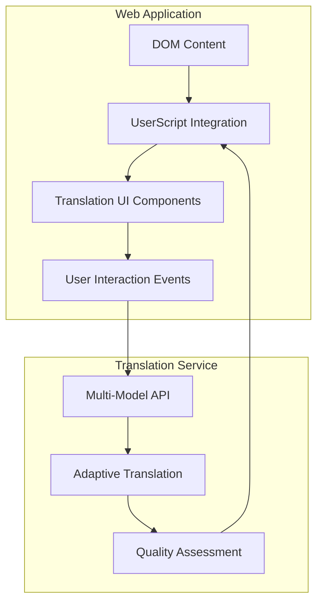

# Web Application Integration Framework

This directory contains **client-side integration implementations** for web applications, demonstrating how to integrate the Multi-Model Translation System into browser-based platforms through UserScripts.

## 🎯 Overview

The Multi-Model Translation System provides a powerful **integration framework** that enables developers to add sophisticated translation capabilities to any web application. Each subdirectory contains a complete integration implementation for specific platforms, serving as both functional tools and reference implementations for custom integrations.

## 🏗️ Integration Architecture

### **Core Integration Pattern**



### **Integration Components**

| Component | Purpose | Implementation |
|-----------|---------|----------------|
| **Content Detection** | Identify translatable text | DOM scanning, content observers |
| **UI Injection** | Add translation controls | Dynamic button/menu insertion |
| **API Communication** | Connect to translation service | HTTP client with authentication |
| **Result Presentation** | Display translations | In-place replacement, overlay, tooltips |
| **User Preferences** | Configuration management | Local storage, settings panels |

## 📱 Available Integrations

### 🚀 **Production Ready**

- **[Telegram Web](./telegram/)** - Complete integration for web.telegram.org
  - ✅ Multi-platform support (K, A, Z versions)
  - ✅ Real-time translation with quality indicators
  - ✅ Adaptive translation for complex content
  - ✅ Progressive translation for long messages
  - ✅ Comprehensive language selection interface

### 🔧 **Planned Integrations**

- **Discord Web** - Discord web client integration
- **WhatsApp Web** - WhatsApp web interface support  
- **Slack Web** - Slack workspace translation
- **Microsoft Teams** - Teams meeting and chat translation
- **Generic Chat** - Universal chat application template

## 🛠️ Building Custom Integrations

### **Step 1: Platform Analysis**

Before building an integration, analyze your target platform:

```javascript
// Identify key elements
const messageSelectors = '.message-content, .text-content, [data-message]';
const containerSelectors = '.chat-container, .messages-list';
const userActionTriggers = 'hover, click, keyboard';

// Understand platform constraints
const platformLimitations = {
    cspPolicy: 'strict|moderate|permissive',
    dynamicContent: true|false,
    reactFramework: true|false,
    shadowDOM: true|false
};
```

### **Step 2: Core Integration Template**

Use this template for new integrations:

```javascript
// ==UserScript==
// @name         Multi-Model Translator - [Platform Name]
// @namespace    http://your-domain.com/
// @version      1.0.0
// @description  Advanced multi-model translation for [Platform Name]
// @author       Your Name
// @match        https://platform.example.com/*
// @grant        GM_xmlhttpRequest
// @grant        GM_setValue
// @grant        GM_getValue
// ==/UserScript==

class PlatformTranslationClient {
    constructor() {
        this.apiClient = new TranslationAPIClient();
        this.uiManager = new PlatformUIManager();
        this.contentScanner = new PlatformContentScanner();
        this.init();
    }
    
    init() {
        this.contentScanner.observe();
        this.uiManager.injectControls();
        this.bindEventHandlers();
    }
    
    async translateContent(element, options = {}) {
        const text = this.contentScanner.extractText(element);
        const translation = await this.apiClient.translate(text, options);
        this.uiManager.displayTranslation(element, translation);
    }
}

// Platform-specific implementations
class PlatformUIManager { /* ... */ }
class PlatformContentScanner { /* ... */ }
class TranslationAPIClient { /* ... */ }

// Initialize
new PlatformTranslationClient();
```

### **Step 3: Platform-Specific Adaptations**

#### **For Chat Applications**
- Message-level translation buttons
- Conversation context preservation  
- Real-time message stream integration
- User avatar and metadata handling

#### **For Document Platforms**
- Paragraph and section-level translation
- Formatting preservation (bold, italic, links)
- Large document chunking strategies
- Version control integration

#### **For Social Media**
- Post and comment translation
- Media caption handling
- Thread and reply context
- Privacy and content policies

## ⚙️ Configuration Framework

### **Unified Configuration Schema**

All integrations share a common configuration structure:

```javascript
const CONFIG = {
    // Server Configuration
    server: {
        url: 'https://your-translation-server.com',
        apiKey: 'your-api-key',
        timeout: 10000,
        retryAttempts: 3
    },
    
    // Translation Preferences
    translation: {
        defaultModel: 'auto|nllb|aya',
        qualityPreference: 'fast|balanced|quality',
        sourceLanguage: 'auto|en|ru|...',
        targetLanguage: 'en|ru|es|...',
        adaptiveThreshold: 500 // chars
    },
    
    // UI Customization
    ui: {
        buttonStyle: 'minimal|standard|detailed',
        showQualityIndicators: true,
        showProgressIndicators: true,
        animationSpeed: 'fast|normal|slow'
    },
    
    // Platform-Specific Settings
    platform: {
        // Platform-specific configuration options
    }
};
```

### **Settings Management**

```javascript
class ConfigurationManager {
    static save(config) {
        GM_setValue('translation_config', JSON.stringify(config));
    }
    
    static load() {
        const saved = GM_getValue('translation_config', null);
        return saved ? JSON.parse(saved) : this.getDefaults();
    }
    
    static createSettingsUI() {
        // Generate dynamic settings interface
    }
}
```

## 🔌 API Integration Guide

### **Authentication Setup**

```javascript
class TranslationAPIClient {
    constructor(serverURL, apiKey) {
        this.baseURL = serverURL;
        this.apiKey = apiKey;
        this.headers = {
            'Content-Type': 'application/json',
            'X-API-Key': apiKey
        };
    }
    
    async translate(text, options = {}) {
        const endpoint = this.selectEndpoint(text, options);
        const payload = this.buildRequest(text, options);
        
        return this.makeRequest(endpoint, payload);
    }
    
    selectEndpoint(text, options) {
        if (options.useAdaptive || text.length > 500) {
            return '/adaptive/translate';
        }
        return '/translate';
    }
}
```

### **Error Handling Pattern**

```javascript
async function robustTranslation(text, options) {
    const strategies = [
        () => this.translateAdaptive(text, options),
        () => this.translateStandard(text, options),
        () => this.translateFallback(text, options)
    ];
    
    for (const strategy of strategies) {
        try {
            return await strategy();
        } catch (error) {
            console.warn('Translation strategy failed:', error);
            continue;
        }
    }
    
    throw new Error('All translation strategies failed');
}
```

## 📊 Quality & Performance

### **Performance Best Practices**

- **Debounced Translation**: Avoid excessive API calls
- **Smart Caching**: Cache translations with quality awareness
- **Batch Processing**: Group multiple requests efficiently
- **Progressive Enhancement**: Degrade gracefully on failures

### **Quality Indicators**

```javascript
class QualityIndicatorUI {
    displayQuality(element, qualityData) {
        const indicator = this.createQualityBadge(qualityData.grade);
        const tooltip = this.createQualityTooltip(qualityData);
        
        element.appendChild(indicator);
        this.attachTooltip(indicator, tooltip);
    }
    
    createQualityBadge(grade) {
        const colors = {
            'A': '#22c55e', 'B': '#84cc16', 'C': '#eab308',
            'D': '#f97316', 'F': '#ef4444'
        };
        
        return this.createElement('span', {
            className: 'quality-badge',
            textContent: grade,
            style: `background-color: ${colors[grade]}`
        });
    }
}
```

## 🧪 Testing Framework

### **Integration Testing Pattern**

```javascript
class IntegrationTestSuite {
    async testBasicTranslation() {
        const mockElement = this.createMockMessageElement();
        const result = await this.translator.translateContent(mockElement);
        
        assert(result.translatedText, 'Translation should return text');
        assert(result.qualityScore > 0, 'Quality score should be present');
    }
    
    async testUIInteraction() {
        const translateButton = this.findTranslateButton();
        this.simulateClick(translateButton);
        
        await this.waitForTranslation();
        assert(this.isTranslationVisible(), 'Translation should be visible');
    }
}
```

## 📚 Integration Examples

### **Simple Text Translation**
```javascript
// Basic implementation for simple content
translator.translateElement(element, {
    model: 'nllb',
    targetLang: 'en'
});
```

### **Advanced Quality-Optimized Translation**
```javascript
// High-quality translation with optimization
translator.translateElement(element, {
    model: 'auto',
    useAdaptive: true,
    qualityPreference: 'quality',
    showProgress: true
});
```

### **Batch Translation**
```javascript
// Efficient batch processing
const elements = document.querySelectorAll('.translatable');
translator.translateBatch(Array.from(elements), {
    batchSize: 5,
    parallelRequests: 2
});
```

## 🤝 Contributing

### **Adding New Integrations**

1. **Create Platform Directory**: `userscripts/[platform-name]/`
2. **Implement Core Template**: Use the integration template above
3. **Platform-Specific Adaptations**: Customize for platform requirements
4. **Testing**: Create comprehensive test suite
5. **Documentation**: Document platform-specific features and limitations

### **Integration Checklist**

- [ ] ✅ Basic text translation functionality
- [ ] ✅ UI controls injection and styling
- [ ] ✅ Configuration management
- [ ] ✅ Error handling and fallbacks
- [ ] ✅ Quality indicators and feedback
- [ ] ✅ Performance optimization
- [ ] ✅ Cross-browser compatibility
- [ ] ✅ Comprehensive documentation
- [ ] ✅ Test coverage > 80%

## 📖 Documentation

- **[Telegram Integration](./telegram/README.md)** - Complete Telegram Web implementation
- **[API Reference](../docs/api/reference.md)** - Translation service API documentation
- **[User Guide](../docs/user_guide.md)** - End-user documentation
- **[Architecture Guide](../docs/architecture/system_architecture.md)** - System architecture overview

---

## 🎯 Getting Started

1. **Choose Your Platform**: Select an existing integration or plan a custom one
2. **Review Integration Patterns**: Study the Telegram implementation as a reference
3. **Set Up Development Environment**: Configure your testing and debugging tools
4. **Build Your Integration**: Follow the template and best practices above
5. **Test Thoroughly**: Ensure robust functionality across scenarios
6. **Share With Community**: Contribute your integration for others to use

**Transform any web application into a powerful multi-language platform with our extensible integration framework!**